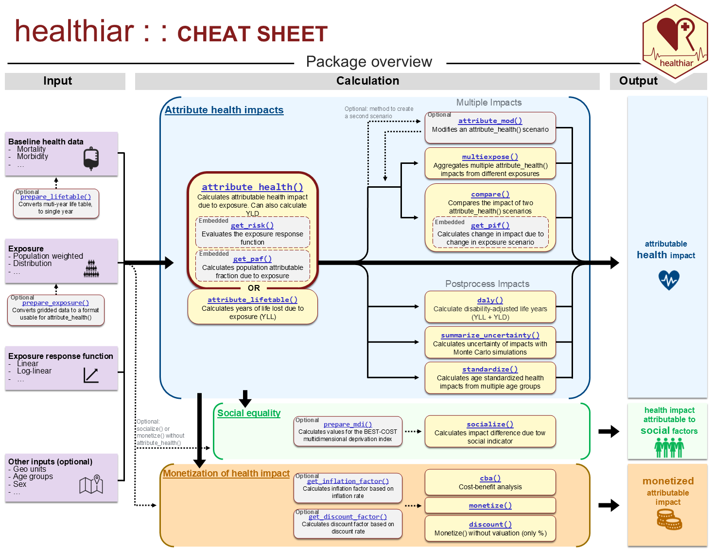

# healthiar 

  

## Introduction

*healthiar* is an R package to quantify and monetize health impacts attributable to exposure (e.g. air pollution, noise...) in a study area. Using *healthiar*, you can ...

- Quantify health impacts choosing among multiple input data formats and calculation pathways:

   - Exposure data as single value or as distribution
   
   - Relative risk or absolute risk
   
   - Fixed-shape or user-defined exposure-response functions
   
   - Single or age-specific baseline health data (life table approach)

- Iterate across geographical units

- Compare scenarios

- Include and summarize uncertainties

- Monetize health impacts or perform cost-benefit analyses adjusting for inflation and discounting

- Consider social inequalities in the assessment and stratify the results

## Getting started 

You have different materials to learn about the R package `healthiar`.

### Cheat sheet
Have a quick and visual look at the [cheat sheet](https://swisstph.github.io/healthiar/articles/cheatsheet.html)

### Vignette
Read the vignette (~ package manual) *intro_to_healthiar*, which you can access

a) on the [package website](https://swisstph.github.io/healthiar/articles/intro_to_healthiar.html) (recommended)

b) in R Studio: Click on the *Packages* tab in RStudio, scroll down to the *healthiar* package and clicking on the hyperlinks *healthiar* > *User guides, package vignettes and other documentation* 

c) in the web browser: Run `browseVignettes("healthiar")` in the R console and the page will open up in your browser

### Function documentation
See the function help pages for information about specific functions. In RStudio, you can access the function documentation of e.g. the function `attribute_health` by

a) going to the [reference page of the package website](https://swisstph.github.io/healthiar/reference/index.html)

b) running `?attribute_health` in RStudio (with `healthiar` loaded)

c) going to the `Packages tab` and then clicking on `healthiar`

### Video
Watch a 45 minutes video from an online international workshop (30 September 2025), which can be found [here](https://team.swisstph.ch/s/aN_wN5MUTAS3bwEkWvtvaQ). 
The slides of the presentation can be found [here](https://github.com/SwissTPH/healthiar/tree/master/varia/Workshops_and_demos/workshop).

## Installation
We recommend frequently installing the newest *healthiar* version. 
Please note that **`healthiar` requires R version 4.2.0 or higher**. 
There are two options to install *healthiar*:

a) **From CRAN**: 

1.- Click on the *Packages* tab in RStudio and on the *Install* button. 

2.- Leave the *Install from:* option set to *Reporsitory (CRAN)*.

3.- Search and select *healthiar*.

4.- Click on *Install* keeping *Install dependencies* activated.

b) **From Github (most recent version)**: Run the following commands below 
in RStudio:

1.- Install the package `remotes` (if not already installed):  
`install.packages("remotes")`

2.- Install `healthiar`: 
`remotes::install_github(repo = "SwissTPH/healthiar", build_vignettes = TRUE, dependencies = TRUE)`

Note that you may be prompted to install or update additional packages dependencies 
required by `healthiar`.

**After installation**, do not forget to load the package by running the call 
`library(healthiar)`. 

## Citation
We love that you use *healthiar*. In that case, please do not forget to cite *healthiar* in your work. Three options to get there: 

a) On the [healthiar package website](https://swisstph.github.io/healthiar/authors.html#citation)  

b) See [CITATION.R](https://github.com/SwissTPH/healthiar/blob/master/inst/CITATION)

c) In your R console, enter *citation("healthiar")*.

In options b) and c), you always see the updated citation. In option a), you see citation of the *healthiar* version that you have installed locally, which might be outdated.

## Disclamer and licence 
By using *healthiar*, you confirm that you agree with the following disclaimer and terms of the licence:

a) Disclaimer: The R package *healthiar* is work in progress and the developers are not liable for the results. 

b) License: Available [here](https://github.com/SwissTPH/healthiar?tab=GPL-3.0-1-ov-file).

## Contributions
We welcome your contributions! 
Do you want to report a bug, provide code or just make a question/comment? 
Please, read and follow the guidelines of our [guide for contributions](https://github.com/SwissTPH/healthiar?tab=contributing-ov-file)
By contributing to *healthiar*,
you agree to abide by our [code of conduct](https://github.com/SwissTPH/healthiar?tab=coc-ov-file).

## Presenting *healthiar*
If you would like us to present *healthiar* at a conference, lecture or training, please, contact us: [alberto.castrofernandez@swisstph.ch](mailto:alberto.castrofernandez@swisstph.ch) and [axel.luyten@swisstph.ch](mailto:axel.luyten@swisstph.ch).

## Acknowledgements
*healthiar* was been developed under the framework of EU project BEST-COST. BEST-COST is funded by the European Union’s Horizon Europe programme under Grant Agreement No.101095408.
