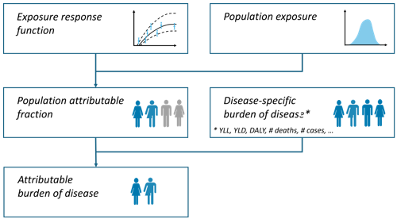
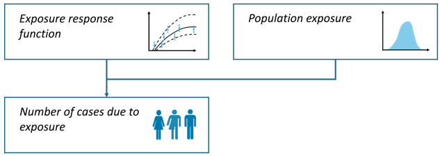

# Vignette: Intro to healthiar

Hi there!

This vignette will tell you about `healthiar` and show you how to use
`healthiar` with the help of examples.

*Note*: Before using `healthiar`, please read carefully the information
provided in the [readme
file](https://github.com/SwissTPH/healthiar?tab=readme-ov-file#readme)
or the [welcome webpage](https://swisstph.github.io/healthiar/). By
using `healthiar`, you agree to the [terms of use and
disclaimer](https://github.com/SwissTPH/healthiar?tab=readme-ov-file#readme).

------------------------------------------------------------------------

## About `healthiar`

The `healthiar` functions allow you to quantify and monetize the health
impacts (or burden of disease) attributable to exposure. The main focus
of the EU project that initiated the development of `healthiar`
(BEST-COST) has been two environmental exposures: air pollution and
noise. However, `healthiar` could be used for other exposures such as
green spaces, chemicals, physical activity…

See below a an overview of the `healthiar`, which is the first page of
the [cheat
sheet](https://swisstph.github.io/healthiar/articles/cheatsheet.html).
The whole list of functions included in `healthiar` is linked there and
available in the
[reference](https://swisstph.github.io/healthiar/reference/index.html).


Figure: Overview of `healthiar`

## Input & output data

### Input

You can enter data in `healthiar` functions using: - hard coded values
or - columns inside pre-loaded data frames or tibbles.

Let’s see some examples calling the most important function in
`healthiar`:
[`attribute_health()`](https://swisstph.github.io/healthiar/reference/attribute_health.md).

#### Hard coded vs. columns

##### Hard coded

Depending on the function argument, you will need to enter numeric or
character values.

``` r

results_pm_copd <- attribute_health(
  exp_central = 8.85, 
  rr_central = 1.369, 
  rr_increment = 10,  
  erf_shape = "log_linear",
  cutoff_central = 5,
  bhd_central = 30747 
)
```

##### Columns

`healthiar` comes with some example data that start with `exdat_` that
allow you to test functions. Some of these example data will be used in
some examples in this vignette.

Now let’s
[`attribute_health()`](https://swisstph.github.io/healthiar/reference/attribute_health.md)
with input data from the `healthiar` example data. Note that you can
easily provide input data to the function argument using the `$`
operator.

``` r

results_pm_copd <- attribute_health(
  erf_shape = "log_linear",
  rr_central = exdat_pm$relative_risk, 
  rr_increment = 10, 
  exp_central = exdat_pm$mean_concentration,
  cutoff_central = exdat_pm$cut_off_value,
  bhd_central = exdat_pm$incidence
)
```

#### Tidy data

Be aware that `healthiar` functions are easier to use if your data is
prepared in a tidy format, i.e.:

- Each variable is a column; each column is a variable.

- Each observation is a row; each row is an observation.

- Each value is a cell; each cell is a single value.

To know more about the concept of tidy format, see the article by
(Wickham 2014).

For example, in `attribute health()` the length of the input vectors to
be entered in the arguments must be either 1 or the result of the
combinations of the different values of:

- `geo_id_micro`

- `exp_...`

- `sex`

- `age`

- (`info` for further sub-group analysis)

### Output

##### Structure

The output of the `healthiar`function
[`attribute_health()`](https://swisstph.github.io/healthiar/reference/attribute_health.md)
and `attribute_lifetable` consists of two lists (“folders”):

- `health_main` contains the main results

- `health_detailed` contained detailed results and additional info about
  the assessment.

In other `healthiar` functions you can find a similar output structure
but using different prefixes. E.g., `social_`in
[`socialize()`](https://swisstph.github.io/healthiar/reference/socialize.md)
and `monetization_`in `monetitize()`.

##### Access

A similar structure can be found in other large functions in
`helathiar`, e.g.,
[`attribute_lifetable()`](https://swisstph.github.io/healthiar/reference/attribute_lifetable.md),
[`compare()`](https://swisstph.github.io/healthiar/reference/compare.md),
[`socialize()`](https://swisstph.github.io/healthiar/reference/socialize.md)
or
[`monetize()`](https://swisstph.github.io/healthiar/reference/monetize.md).
In some functions, different elements are available in the output. For
instance,
[`attribute_lifetable()`](https://swisstph.github.io/healthiar/reference/attribute_lifetable.md)
creates additional output that is specific to life table calculations.

There exist different, equivalent ways of accessing the output:

- With `$` operator: `results_pm_copd$health_main$impact_rounded` (as in
  the example above)

- By mouse: go to the *Environment* tab in RStudio and click on the
  variable you want to inspect, and then open the `health_main` results
  table

- With `[[]]` operator `results_pm_copd[["health_main"]]`

- With `pluck()` & `pull()`: use the
  [`purrr::pluck`](https://purrr.tidyverse.org/reference/pluck.html)
  function to select a list and then the
  [`dplyr::pull`](https://dplyr.tidyverse.org/reference/pull.html)
  function extract values from a specified column,
  e.g. `results_pm_copd |> purrr::pluck("health_main") |> dplyr::pull("impact_rounded")`

------------------------------------------------------------------------

## Function examples

The descriptions of the [`healthiar`
functions](https://swisstph.github.io/healthiar/reference/index.html)
provide examples that you can execute (with `healthiar` loaded) by
running `example("function_name")`, e.g. `example("attribute_health")`.
In the sections below in this vignette, you find additional examples and
more detailed explanations.

## Relative risk

#### Goal

E.g., to quantify the COPD cases attributable to PM2.5 (air pollution)
exposure in a country.

#### Methodology

The comparative risk assessment approach (C. J. Murray et al. 2003) is
applied obtaining the population attributable fraction (percent of cases
that are attributable to the exposure) based on the relative risk. The
exposure scenario is compared with a counter-factual scenario.

This approach has been extensive documented and applied (e.g., WHO 2003;
Steenland and Armstrong 2006; Soares et al. 2022; Pozzer et al. 2023;
GBD 2019 Risk Factors Collaborators 2020; Lehtomäki et al. 2025).



Figure: Relative risk approach

##### Population attributable fraction

General integral form for the **population attributable fraction
(PAF)**:

``` math
PAF = \frac{\int rr\_at\_exp(x) \times PE(x)dx - 1}{\int rr\_at\_exp(x) \times pop\_exp(x)dx}
```

Where:

- $`x`$ = exposure level

- $`PE(x)`$ = population distribution of exposure

- $`rr\_at\exp(x)`$ = relative risk at exposure level compared to
  reference

###### Simplified for categorical exposure distribution

If exposure is categorical, the integrals are converted to sums:

``` math
PAF = \frac{\sum rr\_at\_exp_i \times PE_i - 1}{\sum rr\_at\_exp_i \times PE_i}
```

Alternatively, an equivalent form is:

``` math
PAF = \frac{\sum PE_i \times (rr\_at\_exp_i - 1)}{\sum PE_i\times (rr\_at\_exp_i - 1) + 1}
```

###### Simplified for single exposure value

If there is one single single exposure value, corresponding to the
population weighted mean concentration, the equation can be simplified
as follows:

``` math
PAF = \frac{rr\_at\_exp - 1}{rr\_at\_exp }
```
\#### Scaling relative risk How to get this relative risk at exposure
level (`rr_at_exp`)? This is normally different to the relative risk
published in the epidemiological literature (`rr`) together with the
(concentration/dose) `increment` that corresponds to this relative risk.
The equations used for scaling relative risk depend on the chosen
exposure-response function shapes:

- linear (Lehtomäki et al. 2025)
  ``` math
  RRexp = 1 + \frac{rr - 1}{increment} \times (exp - cutoff)
  ```

- log-linear (Lehtomäki et al. 2025)
  ``` math
  RRexp = e^{\frac{\log(rr)}{increment} \times (exp - cutoff)}
  ```

- log-log (Lehtomäki et al. 2025)
  ``` math
  RRexp = \left( \frac{exp + 1}{cutoff + 1} \right)^{\frac{\log(rr)}{\log(increment + cutoff + 1) - \log(cutoff + 1)}}
  ```

- linear-log (Pozzer et al. 2023)
  ``` math
  RRexp = 1 + \frac{\log(rr - 1)}{\log(increment + cutoff + 1) - \log(cutoff + 1)} \times \frac{\log(exp + 1)}{\log(cutoff + 1)}
  ```

The relative risk at exposure level (`rr_at_exp`) and is part of the
output of
[`attribute_health()`](https://swisstph.github.io/healthiar/reference/attribute_health.md)
and
[`attribute_lifetable()`](https://swisstph.github.io/healthiar/reference/attribute_lifetable.md).
`rr_at_exp` can also be calculated using
[`get_risk()`](https://swisstph.github.io/healthiar/reference/get_risk.md).

For conversion of hazard ratios and/or odds ratios to relative risks
refer to (VanderWeele 2019) and/or use the conversion tools developed by
the Teaching group in EBM in 2022 for hazard ratios
(<https://ebm-helper.cn/en/Conv/HR_RR.html>) and/or odds ratios
(<https://ebm-helper.cn/en/Conv/OR_RR.html>).

#### Function call

``` r

results_pm_copd <- attribute_health(
  approach_risk = "relative_risk", # If you do not call this argument, "relative_risk" will be assigned by default.
  erf_shape = "log_linear",
  rr_central = exdat_pm$relative_risk, 
  rr_increment = 10, 
  exp_central = exdat_pm$mean_concentration,
  cutoff_central = exdat_pm$cut_off_value,
  bhd_central = exdat_pm$incidence
)
```

#### Main results

``` r

results_pm_copd$health_main
#> # A tibble: 1 × 24
#>   geo_id_micro erf_ci  exp_ci  bhd_ci  cutoff_ci exp_category sex   age_group
#>   <chr>        <chr>   <chr>   <chr>   <chr>            <int> <chr> <chr>    
#> 1 a            central central central central              1 all   all      
#> # ℹ 16 more variables: impact <dbl>, impact_rounded <dbl>, approach_risk <chr>,
#> #   rr_increment <dbl>, erf_shape <chr>, prop_pop_exp <dbl>, exp_length <int>,
#> #   exp_type <chr>, exp <dbl>, bhd <dbl>, cutoff <dbl>, rr <dbl>,
#> #   is_lifetable <lgl>, pop_fraction_type <chr>, rr_at_exp <dbl>,
#> #   pop_fraction <dbl>
```

It is a table of the format `tibble` of 3 rows and 23 columns. Be aware
that this main output contains input data, some intermediate steps and
the final results in different formats.

Let’s zoom in on some relevant aspects.

``` r

results_pm_copd$health_main |> 
  dplyr::select(exp, bhd, rr, erf_ci, pop_fraction, impact_rounded) |> 
  knitr::kable() # For formatting reasons only: prints tibble in nice layout
```

|  exp |   bhd |    rr | erf_ci  | pop_fraction | impact_rounded |
|-----:|------:|------:|:--------|-------------:|---------------:|
| 8.85 | 30747 | 1.369 | central |    0.1138961 |           3502 |

Interpretation: this table shows us that exposure was 8.85
$`\mu g/m^3`$, the baseline health data (`bhd_central`) was 30747 (COPD
incidence in this instance). The 1st row further shows that the impact
attributable to this exposure using the central relative risk
(`rr_central`) estimate of 1.369 is 3502 COPD cases, or ~11% of all
baseline cases.

Some of the most results columns include:

- *impact_rounded* rounded attributable health impact/burden
- *impact* raw impact/burden
- *pop_fraction* population attributable fraction (PAF) or population
  impact fraction (PIF)

## Absolute risk

#### Goal

E.g., to quantify the number incidence cases of high annoyance
attributable to (road traffic) noise exposure.

#### Methodology

In the absolute risk calculation pathway, estimates are based on the
size and distribution of the exposed population, rather than on baseline
health data, as is the case in the relative risk pathway (WHO 2011).



Figure: Absolute risk approach

``` math
N = \sum AR_i \times PE_i
```

Where:

- $`N`$ = attributed cases

- $`AR_i`$ = absolute risk at category $`i`$

- $`PE_i`$ = absolute population exposed at category $`i`$

`healthiar` consistently handles cut-off values across both relative and
absolute risk approaches. When a `cutoff_` argument is specified
alongside an exposure–response function (`erf_eq_`), the function
evaluates exposure as excess exposure relative to the cut-off (`c` as
$`\text{exp} - \text{cutoff}`$), effectively shifting the function by
the cut-off. However, many absolute risk curves published in the
literature are parameterized on raw exposure levels that already
incorporate the cut-off directly into the function definition.
Therefore, `healthiar` issues an informative warning if both `erf_eq_`
and a `cutoff_` are specified when using
[`attribute_health()`](https://swisstph.github.io/healthiar/reference/attribute_health.md).
If your absolute risk function is parameterized on raw exposure levels
rather than on the exposure above the cut-off, see chapter [Shifted
vs. unshifted exposure-response functions](#shifted-vs-unshifted-erf).

#### Function call

``` r

results_noise_ha <- attribute_health(
  approach_risk = "absolute_risk", # default is "relative_risk"
  exp_central = c(57.5, 62.5, 67.5, 72.5, 77.5), # mean of the exposure categories
  pop_exp = c(387500, 286000, 191800, 72200, 7700), # population exposed per exposure category
  erf_eq_central = "78.9270-3.1162*c+0.0342*c^2" # exposure-response function
)
```

The `erf_eq_central` argument can digest other types of functions (see
section on user-defined ERF).

#### Main results

| erf_eq                      | erf_ci  | impact_rounded |
|:----------------------------|:--------|---------------:|
| 78.9270-3.1162*c+0.0342*c^2 | central |         174232 |

#### Results per noise exposure band

``` r

results_noise_ha$health_detailed$results_raw
```

| exp_category |  exp | pop_exp |    impact |
|-------------:|-----:|--------:|----------:|
|            1 | 57.5 |  387500 | 49674.594 |
|            2 | 62.5 |  286000 | 50788.595 |
|            3 | 67.5 |  191800 | 46813.105 |
|            4 | 72.5 |   72200 | 23657.232 |
|            5 | 77.5 |    7700 |  3298.314 |

Remember, that if the equation of the exposure-response function
(`erf_eq_...`) requires taking a maximum in a vectorised context,
[`pmax()`](https://rdrr.io/r/base/Extremes.html) must be used instead of
[`max()`](https://rdrr.io/r/base/Extremes.html).
[`pmax()`](https://rdrr.io/r/base/Extremes.html) should be used whenever
an element-wise maximum is required (the output will be a vector), while
[`max()`](https://rdrr.io/r/base/Extremes.html) returns a single global
maximum for the entire vector. For example:

``` r

erf_eq_central <- 
  "exp(0.2969*log((pmax(0,c-2.4)/1.9+1))/(1+exp(-(pmax(0,c-2.4)-12)/40.2)))"  
```

#### One exposure category

Alternatively, it’s also possible to only assess the absolute risk
impacts for one exposure category (e.g., a single noise exposure band).

``` r

results_noise_ha <- attribute_health(
  approach_risk = "absolute_risk",
  exp_central = 57.5,
  pop_exp = 387500,
  erf_eq_central = "78.9270-3.1162*c+0.0342*c^2"
)
```

| exp_category |   impact |
|-------------:|---------:|
|            1 | 49674.59 |

## Multiple geographic units

### using relative risk

#### Goal

E.g., to quantify the disease cases attributable to PM2.5 exposure in
multiple cities using one single command.

#### Function call

- Enter unique ID’s as a vector (`numeric` or `character`) to the
  `geo_id_micro` argument (e.g., municipality names or province
  abbreviations)

- Optional: aggregate unit-specific results by providing higher-level
  ID’s (e.g., region names or country abbreviations) as a vector
  (`numeric` or `character`) to the `geo_id_macro` argument

Input to the other function arguments is specified as usual, either as a
vector or a single values (which will be recycled to match the length of
the other input vectors).

``` r

results_iteration <- attribute_health(
    # Names of Swiss cantons
    geo_id_micro = c("Zurich", "Basel", "Geneva", "Ticino", "Jura"),
    # Names of languages spoken in the selected Swiss cantons
    geo_id_macro = c("German","German","French","Italian","French"),
    rr_central = 1.369,
    rr_increment = 10, 
    cutoff_central = 5,
    erf_shape = "log_linear",
    exp_central = c(11, 11, 10, 8, 7),
    bhd_central = c(4000, 2500, 3000, 1500, 500)
)
```

In this example we want to aggregate the lower-level geographic units
(municipalities) by the higher-level language region
(`"German", "French", "Italian"`).

#### Main results

The main output contains aggregated results

| geo_id_macro | impact_rounded | erf_ci  | exp_ci  | bhd_ci  |
|:-------------|---------------:|:--------|:--------|:--------|
| German       |           1116 | central | central | central |
| French       |            466 | central | central | central |
| Italian      |            135 | central | central | central |

In this case `health_main` contains the cumulative / summed number of
stroke cases attributable to PM2.5 exposure in the 5 geo units, which is
1717 (using a relative risk of 1.369).

#### Detailed results

The geo unit-specific information and results are stored under
`health_detailed`\>`results_raw` .

| geo_id_micro | impact_rounded | geo_id_macro |
|:-------------|---------------:|:-------------|
| Zurich       |            687 | German       |
| Basel        |            429 | German       |
| Geneva       |            436 | French       |
| Ticino       |            135 | Italian      |
| Jura         |             30 | French       |

`health_detailed` also contains impacts obtained through all
combinations of input data central, lower and upper estimates (as
usual), besides the results per geo unit (not shown above).

### using absolute risk

#### Goal

E.g., to quantify high annoyance cases attributable to noise exposure in
rural and urban areas.

#### Function call

``` r

data <- exdat_noise |> 
  ## Filter for urban and rural regions
  dplyr::filter(region == "urban" | region == "rural")
```

``` r

results_iteration_ar <- attribute_health( 
    # Both the rural and urban areas belong to the higher-level "total" region
    geo_id_macro = "total",
    geo_id_micro = data$region,
    approach_risk = "absolute_risk",
    exp_central = data$exposure_mean,
    pop_exp = data$exposed,
    erf_eq_central = "78.9270-3.1162*c+0.0342*c^2"
)
```

*Note*: the length of the input vectors fed to `geo_id_micro`,
`exp_central`, `pop_exp` must match and must be

(number of geo units) x (number of exposure categories) = 2 x 5 =
**10**,

because we have 2 geo units (`"rural"` and `"urban"`) and 5 exposure
categories.

#### Main results

`health_main` contains the aggregated results (i.e. sum of impacts in
rural and urban areas).

| geo_id_macro | impact_rounded | erf_ci  | exp_ci  |
|:-------------|---------------:|:--------|:--------|
| total        |         174232 | central | central |

#### Detailed results

Impact by geo unit, in this case impact in the rural and in the urban
area.

| geo_id_micro | geo_id_macro |    impact |
|:-------------|:-------------|----------:|
| urban        | total        | 150904.00 |
| rural        | total        |  23327.84 |

## Uncertainty

### Confidence interval

#### Goal

E.g., to quantify the COPD cases attributable to PM2.5 exposure taking
into account uncertainty (lower and upper bound of confidence interval)
in several input arguments: relative risk, exposure and baseline health
data.

#### Function call

``` r

results_pm_copd <- attribute_health(
    erf_shape = "log_linear",
    rr_central = 1.369, 
    rr_lower = 1.124, # lower 95% confidence interval (CI) bound of RR
    rr_upper = 1.664, # upper 95% CI bound of RR
    rr_increment = 10, 
    exp_central = 8.85, 
    exp_lower = 8, # lower 95% CI bound of exposure
    exp_upper = 10, # upper 95% CI bound of exposure
    cutoff_central = 5,
    bhd_central = 30747, 
    bhd_lower = 28000, # lower 95% confidence interval estimate of BHD
    bhd_upper = 32000 # upper 95% confidence interval estimate of BHD
) 
```

#### Detailed results

Let’s inspect the detailed results:

| erf_ci  | exp_ci  | bhd_ci  | impact_rounded |
|:--------|:--------|:--------|---------------:|
| central | central | central |           3502 |
| lower   | central | central |           1353 |
| upper   | central | central |           5474 |
| central | central | lower   |           3189 |
| lower   | central | lower   |           1232 |
| upper   | central | lower   |           4985 |
| central | central | upper   |           3645 |
| lower   | central | upper   |           1408 |
| upper   | central | upper   |           5697 |

Each row contains the estimated attributable cases (`impact_rounded`)
obtained by the input data specified in the columns ending in “\_ci” and
the other calculation pathway specifications in that row (not shown).

- The 1st contains the estimated attributable impact when using the
  central estimates of relative risk, exposure and baseline health data.

- The 2nd row shows the impact when using the central estimates of the
  relative risk, exposure in combination with the lower estimate of the
  baseline health data.

- …

*Note*: only 9 of the 27 possible combinations are displayed due to
space constraints.

*Note*: only a selection of columns are shown.

### Monte Carlo simulation

#### Goal

E.g., to summarize uncertainty of attributable health impacts (i.e. to
get a single confidence interval instead of many combinations) by using
a Monte Carlo simulation.

#### Methodology

##### General concepts

A Monte Carlo simulation is a statistical method that generates repeated
random sampling (Robert and Casella 2004; Rubinstein and Kroese 2016).
In `healthiar`, you can use the function
[`summarize_uncertainty()`](https://swisstph.github.io/healthiar/reference/summarize_uncertainty.md)
to simulate values in the arguments with uncertainty and estimate a
single confidence interval in the results.

For each entered input argument that includes a (95%) confidence
interval (i.e. `_lower` and `_upper` bound value) a distribution is
fitted (see distributions below). The median of the simulated
attributable impacts is reported as the central estimate. The 2.5th and
97.5th percentiles of these simulated impacts define the lower and upper
bounds of the 95% summary uncertainty interval. Aggregated estimates
(e.g. for a `geo_id_macro` covering several `geo_id_micro`) are obtained
by first summing the impacts of all lower level units within each
simulation and only then taking the median and the 2.5th and 97.5th
percentiles of these sums. Summing instead the central, lower and upper
estimates of each lower level unit would assume that the uncertainty is
perfectly correlated across the units and would therefore overestimate
the width of the confidence interval.

##### Distributions used for simulation

[`summarize_uncertainty()`](https://swisstph.github.io/healthiar/reference/summarize_uncertainty.md)
assumes the following shapes of the distributions in the simulations:

- Relative risk: The values are simulated based on an optimized *gamma*
  distribution, which fits well as relative risks are positive and their
  distributions are usually right-skewed. The gamma distribution is
  parametrized such that its mean is equal to the central relative risk
  estimate (`rate= shape/rr_central`). The shape parameter is then
  optimized using
  [`stats::optimize()`](https://rdrr.io/r/stats/optimize.html) to match
  the inputed 95% confidence interval bounds, with
  [`stats::qgamma()`](https://rdrr.io/r/stats/GammaDist.html) used to
  evaluate candidate distributions. Finally, `n_sim` relative risk
  values are simulated using
  [`stats::rgamma()`](https://rdrr.io/r/stats/GammaDist.html).

- Exposure, cutoff, baseline health data and duration: The values are
  simulated based on a *normal* distribution using
  [`stats::rnorm()`](https://rdrr.io/r/stats/Normal.html) with
  `mean = exp_central`, `mean = cutoff_central`, `mean = bhd_central` or
  `mean = duration_central` and a standard deviation based on
  corresponding lower and upper 95% exposure confidence interval values.
  The standard deviation is calculated as
  ``` math
  (upper-lower)/(2*1.96)
  ```
  , since for a normal distribution the 95% CI spans approximately two
  standard deviations on either side of the mean. As these four
  variables cannot be negative, the distribution is truncated at zero,
  i.e. negative values are discarded and drawn again until they are
  positive.

Please note that the normal distribution is symmetric. Therefore, the
simulated values reproduce the entered confidence interval only if the
entered `_lower` and `_upper` values are symmetric around the `_central`
value. Only the width of the entered confidence interval is used, not
its shape. The more asymmetric the entered confidence interval, the more
the simulated values will depart from it. Moreover, if the entered
confidence interval is so wide that a relevant share of the distribution
falls below zero, the truncation at zero shifts the simulated central
estimate above the entered `_central` value.

- Disability weights: The values are simulated based on a *beta*
  distribution, as both the disability weights and the beta distribution
  are bounded by 0 and 1. The beta distribution best fitting the
  inputted central disability weight estimate and corresponding lower
  and upper 95% confidence interval values is fitted using
  [`stats::qbeta()`](https://rdrr.io/r/stats/Beta.html) (the best
  fitting distribution parameters `shape1` and `shape2` are determined
  using [`stats::optimize()`](https://rdrr.io/r/stats/optimize.html)).
  For this purpose, we partly adapted the R function
  `prevalence::beta_expert` with permission of one of the authors
  (Devleesschauwer et al. 2022). Finally, `n_sim` disability weight
  values are simulated using
  [`stats::rbeta()`](https://rdrr.io/r/stats/Beta.html).

For stability of the 95% confidence interval, a large number of
simulations (e.g., 10,000) is recommended in practice. The example below
uses n_sim = 100 for brevity.

#### Function call

``` r

results_pm_copd_summarized <- 
  summarize_uncertainty(
    output_attribute = results_pm_copd,
    n_sim = 100
)
```

#### Main results

The outcome of the Monte Carlo analysis is added to the variable entered
as the `results` argument, which is `results_pm_copd` in our case.

Two lists (“folders”) are added:

- `uncertainty_main` contains the central estimate and the corresponding
  95% confidence intervals obtained through the Monte Carlo assessment
  and

- `uncertainty_detailed` contains all `n_sim` simulations of the Monte
  Carlo assessment.

| geo_id_micro | impact_ci        |   impact | impact_rounded |
|:-------------|:-----------------|---------:|---------------:|
| a            | central_estimate | 3654.885 |           3655 |
| a            | lower_estimate   | 1589.442 |           1589 |
| a            | upper_estimate   | 5600.248 |           5600 |

#### Detailed results

The folder `uncertainty_detailed` contains all single simulations. Let’s
look at the impact of the first 10 simulations.

The columns `erf_ci`, `exp_ci`, `bhd_ci`, and `cutoff_ci` indicate the
source of uncertainty component used for that simulation (in the first
10 simulations, all use central estimates).

| geo_id_micro | erf_ci | exp_ci | bhd_ci | cutoff_ci | exp_category | sex | age_group | sim_id | impact | impact_rounded | approach_risk | rr_increment | erf_shape | prop_pop_exp | exp_length | exp_type | cutoff | is_lifetable | geo_id_number | rr | exp | bhd | pop_fraction_type | rr_at_exp | pop_fraction |
|:---|:---|:---|:---|:---|---:|:---|:---|---:|---:|---:|:---|---:|:---|---:|---:|:---|---:|:---|---:|---:|---:|---:|:---|---:|---:|
| a | central | central | central | central | 1 | all | all | 1 | 2629.951 | 2630 | relative_risk | 10 | log_linear | 1 | 1 | population_weighted_mean | 5 | FALSE | 1 | 1.276850 | 8.740519 | 30103.82 | paf | 1.095725 | 0.0873627 |
| a | central | central | central | central | 1 | all | all | 2 | 4628.066 | 4628 | relative_risk | 10 | log_linear | 1 | 1 | population_weighted_mean | 5 | FALSE | 1 | 1.551852 | 8.758388 | 30399.07 | paf | 1.179584 | 0.1522437 |
| a | central | central | central | central | 1 | all | all | 3 | 4493.994 | 4494 | relative_risk | 10 | log_linear | 1 | 1 | population_weighted_mean | 5 | FALSE | 1 | 1.543406 | 8.798881 | 29566.80 | paf | 1.179238 | 0.1519946 |
| a | central | central | central | central | 1 | all | all | 4 | 4474.906 | 4475 | relative_risk | 10 | log_linear | 1 | 1 | population_weighted_mean | 5 | FALSE | 1 | 1.419867 | 9.213612 | 32586.97 | paf | 1.159181 | 0.1373219 |
| a | central | central | central | central | 1 | all | all | 5 | 1650.331 | 1650 | relative_risk | 10 | log_linear | 1 | 1 | population_weighted_mean | 5 | FALSE | 1 | 1.157613 | 8.812466 | 30409.10 | paf | 1.057385 | 0.0542710 |
| a | central | central | central | central | 1 | all | all | 6 | 3728.251 | 3728 | relative_risk | 10 | log_linear | 1 | 1 | population_weighted_mean | 5 | FALSE | 1 | 1.430150 | 8.830799 | 29108.69 | paf | 1.146895 | 0.1280803 |
| a | central | central | central | central | 1 | all | all | 7 | 3879.688 | 3880 | relative_risk | 10 | log_linear | 1 | 1 | population_weighted_mean | 5 | FALSE | 1 | 1.465879 | 8.502208 | 30948.22 | paf | 1.143328 | 0.1253606 |
| a | central | central | central | central | 1 | all | all | 8 | 3917.858 | 3918 | relative_risk | 10 | log_linear | 1 | 1 | population_weighted_mean | 5 | FALSE | 1 | 1.442681 | 8.684553 | 31015.55 | paf | 1.144583 | 0.1263191 |
| a | central | central | central | central | 1 | all | all | 9 | 3038.873 | 3039 | relative_risk | 10 | log_linear | 1 | 1 | population_weighted_mean | 5 | FALSE | 1 | 1.320146 | 8.880695 | 29741.04 | paf | 1.113806 | 0.1021778 |
| a | central | central | central | central | 1 | all | all | 10 | 2145.128 | 2145 | relative_risk | 10 | log_linear | 1 | 1 | population_weighted_mean | 5 | FALSE | 1 | 1.253879 | 8.549538 | 27799.07 | paf | 1.083618 | 0.0771655 |

## User-defined ERF

#### Goal

E.g., to quantify COPD cases attributable to air pollution exposure by
applying a user-defined exposure-response function (ERF), such as the
MR-BRT curves from Global Burden of Disease study.

#### Function call

In this case, the function arguments `erf_eq_...` require a function as
input, so we use an auxiliary function
([`splinefun()`](https://rdrr.io/r/stats/splinefun.html)) to transform
the points on the ERF into type `function`.

``` r

results_pm_copd_mr_brt <- attribute_health(
  exp_central = 8.85,
  bhd_central = 30747,
  cutoff_central = 0,
  # Specify the function based on x-y point pairs that lie on the ERF
  erf_eq_central = splinefun(
    x = c(0, 5, 10, 15, 20, 25, 30, 50, 70, 90, 110),
    y = c(1.00, 1.04, 1.08, 1.12, 1.16, 1.20, 1.23, 1.35, 1.45, 1.53, 1.60),
    method = "natural")
)
```

The ERF curve created looks as follows


Alternatively, other functions
(e.g. [`approxfun()`](https://rdrr.io/r/stats/approxfun.html)) can be
used to create the ERF

## Sub-group analysis

### by age group

#### Goal

E.g., to quantify health impacts attributable to air pollution in a
country *by age group*.

#### Function call

To obtain age-group-specific results, the baseline health data (and
possibly exposure) must be available by age group.

If the `age` argument was specified, age-group-specific results are
available under `health_detailed` in the sub-folder
`results_by_age_group`.

``` r

results_age_group <- attribute_health(
        approach_risk = "relative_risk",
        age = c("below_65", "65_plus"),
        exp_central = c(8, 7),
        cutoff_central = c(5, 5),
        bhd_central = c(1000, 5000),
        rr_central = 1.06,
        rr_increment = 10,
        erf_shape = "log_linear"
      )
```

#### Results by age group

``` r

results_age_group$health_detailed$results_by_age_group |> 
  dplyr::select(age_group, impact_rounded, exp, bhd) |> 
  knitr::kable()
```

| age_group | impact_rounded | exp |  bhd |
|:----------|---------------:|----:|-----:|
| below_65  |             17 |   8 | 1000 |
| 65_plus   |             58 |   7 | 5000 |

### by sex

#### Goal

E.g., to quantify health impacts attributable to air pollution in a
country *by sex*.

#### Function call

The baseline health data (and possibly exposure) must be entered by sex.

``` r

results_sex <- attribute_health(
        approach_risk = "relative_risk",
        sex = c("female", "male"),
        exp_central = c(8, 8),
        cutoff_central = c(5, 5),
        bhd_central = c(1000, 1100),
        rr_central = 1.06,
        rr_increment = 10,
        erf_shape = "log_linear"
      )
```

#### Results by sex

If the `sex` argument was specified, sex-specific results are available
under `health_detailed` in the sub-folder `results_by_sex`.

``` r

results_sex$health_detailed$results_by_sex |> 
  dplyr::select(sex, impact_rounded, exp, bhd) |> 
  knitr::kable()
```

| sex    | impact_rounded | exp |  bhd |
|:-------|---------------:|----:|-----:|
| female |             17 |   8 | 1000 |
| male   |             19 |   8 | 1100 |

### by other sub-groups

#### Goal

E.g., to quantify attributable health impacts *stratified by a sub-group
different to age and sex, e.g., education level*.

#### Function call

A single vector (or a data frame / tibble with multiple columns) to
group the results by can be entered to the `info` argument. In this
example, this will be information about the education level.

In a second step one can group the results based on one or more columns
and so summarize the results by the preferred sub-groups.

``` r

output_attribute <- healthiar::attribute_health(
    rr_central = 1.063,
    rr_increment = 10,
    erf_shape = "log_linear",
    cutoff_central =  0,
    exp_central = c(6, 7, 8,
                    7, 8, 9,
                    8, 9, 10,
                    9, 10, 11),
    bhd_central = c(600, 700, 800,
                    700, 800, 900,
                    800, 900, 1000,
                    900, 1000, 1100),
    geo_id_micro = rep(c("a", "b", "c", "d"), each = 3),
    info = data.frame(
      education = rep(c("secondary", "bachelor", "master"), times = 4)) # education level
  )
```

#### Results by other sub-group

``` r

output_stratified <- output_attribute$health_detailed$results_raw |>
      dplyr::group_by(info_column_1) |>
      dplyr::summarize(mean_impact = mean(impact))|>
      dplyr::pull(mean_impact) |>
      print()
#> [1] 43.72087 54.26844 34.30332
```

### by age, sex and other sub-groups

#### Goal

E.g., to quantify attributable health impacts *stratified by age, sex
and additional sub-group e.g. education level*.

#### Function call

``` r

output_attribute <- healthiar::attribute_health(
    rr_central = 1.063,
    rr_increment = 10,
    erf_shape = "log_linear",
    cutoff_central =  0,
    age_group = base::rep(c("50_and_younger", "50_plus"), each = 4, times= 2),
    sex = base::rep(c("female", "male"), each = 2, times = 4),
    exp_central = c(6, 7, 8, 7, 8, 9, 8, 9,
                    10, 9, 10, 11, 10, 11, 12, 13),
    bhd_central = c(600, 700, 800, 700, 800, 900, 800, 900,
                    1000, 900, 1000, 1100, 1000, 1100, 1200, 1000),
    geo_id_micro = base::rep(c("a", "b"), each = 8),
    info = base::data.frame(
      education = base::rep(c("without_master", "with_master"), times = 8)) # education level
  )
```

#### Results by all sub-groups

``` r

output_stratified <- output_attribute$health_detailed$results_raw |>
      dplyr::group_by(info_column_1) |>
      dplyr::summarize(mean_impact = mean(impact))|>
      dplyr::pull(mean_impact) |>
      print()
#> [1] 52.80090 49.83826
```

## YLL & deaths with life table

### Data preparation

The life table approach to obtain YLL and deaths requires population and
baseline mortality data to be stratified by *one year* age groups.
However, in some cases these data are only available for larger age
groups (e.g., 5-year data: 0-4 years old, 5-9 years old, …). What to do?

- If your population and mortality data are *not* available by one-year
  age group, data must be prepared by interpolating values. The
  `healthiar` function
  [`prepare_lifetable()`](https://swisstph.github.io/healthiar/reference/prepare_lifetable.md)
  makes this conversion using the same approach as the WHO tool AirQ+
  (WHO 2020). In standard AirQ+ life table disaggregations, deaths are
  assumed to be distributed uniformly across age intervals with a
  fraction of the age interval lived of 0.5. The argument
  `fraction_lived` allows other assumptions, see the section on the
  fraction of the age interval lived below.

- If your population and death data are stratified by one-year age
  group, you are lucky, you can ignore this initial step.
  [`prepare_lifetable()`](https://swisstph.github.io/healthiar/reference/prepare_lifetable.md)
  passes single-year data on unchanged, so it can also be used for a
  life table that mixes already available single-year data with
  converted larger age groups.

``` r

age_groups <- c(0, 5, 10, 15)
pop <- c(438200, 445100, 439800, 421500)
bhd_counts <- c(1420, 45, 50, 125)

# Standard uniform disaggregation (fraction_lived = 0.5)
prepared_data <- healthiar::prepare_lifetable(
  age_group = age_groups,
  population = pop,
  bhd = bhd_counts
  # fraction_lived = 0.5 (default)
)

# Age-group specific fraction of the age interval lived (first fraction_lived = 0.1)
prepared_data_with_age_specific_fraction_lived <- healthiar::prepare_lifetable(
  age_group = age_groups,
  population = pop,
  bhd = bhd_counts,
  fraction_lived = c(0.1, 0.5, 0.5, 0.5)
)
```

#### Fraction of the age interval lived

The argument `fraction_lived`, available in both
[`prepare_lifetable()`](https://swisstph.github.io/healthiar/reference/prepare_lifetable.md)
and
[`attribute_lifetable()`](https://swisstph.github.io/healthiar/reference/attribute_lifetable.md),
is the average fraction of an age interval that is lived by those who
die in it. It corresponds to $`_na_x`$ in the life table literature
(Chiang 1984; Preston et al. 2001). The default of 0.5 for all age
groups means that deaths are evenly distributed over the age interval,
which is the value that AirQ+ assumes (WHO 2020). It can be entered as a
single value applying to all age groups or as one value per age group.

##### What it determines

With $`_nm_x`$ the death rate of an age interval of width $`n`$, the
probability of dying in that interval is

``` math
_nq_x = \frac{n \times {}_nm_x}{1 + n \times (1 - {}_na_x) \times {}_nm_x}
```

and the person-years lived at a single year of age, i.e. its mid-year
population, is one year for each person reaching the next birthday plus
$`fraction\_lived`$ years for each person dying at that age:

``` math
midyear\_population = entry\_population - (1 - fraction\_lived) \times deaths
```

In
[`prepare_lifetable()`](https://swisstph.github.io/healthiar/reference/prepare_lifetable.md)
these two relations fix the conversion. The entry population of the
first single year of age of an age group follows from the condition that
the conversion may neither create nor lose population, i.e. that the
single-year mid-year populations have to add up to the mid-year
population of the age group that was entered:

``` math
entry\_population_{first} = \frac{population + (1 - fraction\_lived) \times bhd}{\sum_{k = 0}^{n - 1} prob\_survival^{\,k}}
```

For $`fraction\_lived = 0.5`$ this reproduces the values published in
the AirQ+ manual, and unlike the formula given there it holds for any
age interval width and any value of `fraction_lived`.

Both relations are checked in internal tests in `healthiar`against a
published life table, the abridged life table for Austrian males in 1992
(Preston et al. 2001), in which the fraction of the age interval lived
ranges from 0.48 to 0.63 in the 5-year age groups and is 0.068 at age 0.
Applying the probability of dying obtained by
[`prepare_lifetable()`](https://swisstph.github.io/healthiar/reference/prepare_lifetable.md)
to the published survivors reproduces the published deaths of that life
table for every age group, and the entry population it determines from
the published mid-year population and deaths at age 0 reproduces the
published number of survivors.

##### What it does not determine

`fraction_lived` is *not* a way to control how the deaths of an age
group are distributed over the single years of age it contains. That
distribution follows from the survival probabilities, as in AirQ+, so
`fraction_lived` influences it only indirectly and far too weakly to be
used for it. Both quantities are distinct in the life table literature
and the distribution of the deaths cannot be derived from
$`_na_x`$(Preston et al. 2001).

[`prepare_lifetable()`](https://swisstph.github.io/healthiar/reference/prepare_lifetable.md)
can therefore not reproduce the concentration of deaths at age 0 that is
observed in low-mortality settings. If the deaths at age 0 matter for
your assessment, obtain single-year population and death data for the
youngest ages instead of relying on the conversion.

##### How to choose it

The sensitivity of the survival probability to `fraction_lived` is

``` math
\frac{\partial \; prob\_survival}{\partial \; fraction\_lived} = - \frac{hazard\_rate^2}{(1 + (1 - fraction\_lived) \times hazard\_rate)^2}
```

i.e. it grows with the square of the hazard rate. `fraction_lived`
therefore matters little in the age groups with a low mortality and most
in those with the highest mortality, which are the last ones. With the
example data of this vignette, entering 0.1 for age 0 changes the YLL by
0.01%, whereas adapting the last age group changes them by 0.25%.

Values of $`_na_x`$ other than 0.5 are usually derived from the
mortality level itself. For age 0 and for the ages 1 to 4, Preston et
al. (2001) report rules of thumb going back to Coale and Demeny,
e.g. $`_1a_0 = 0.045 + 2.684 \times {}_1m_0`$ for males with
$`_1m_0 < 0.107`$. For an open-ended last age group, $`_na_x`$ is the
remaining life expectancy $`1 / {}_nm_x`$, which can exceed the width of
the age interval.

Whichever `fraction_lived` is used in
[`prepare_lifetable()`](https://swisstph.github.io/healthiar/reference/prepare_lifetable.md)
has to be passed on to
[`attribute_lifetable()`](https://swisstph.github.io/healthiar/reference/attribute_lifetable.md),
which needs the same assumption to obtain the survival probabilities.
The output column `fraction_lived_for_attribute` is provided for that
purpose.

### YLL

#### Goal

E.g., to quantify the years of life lost (YLL) due to deaths from COPD
attributable to PM2.5 exposure during one year.

#### Methodology

##### General concept

The life table methodology of
[`attribute_lifetable()`](https://swisstph.github.io/healthiar/reference/attribute_lifetable.md)
follows that of the WHO tool AirQ+ (WHO 2020), which is described in
more detail by Miller and Hurley (2003). The generalized formulas, which
do not assume a fixed fraction of life lived (fraction_lived = 0.5), are
based on the foundational work by Chiang (1984). In short, two scenarios
are compared:

1.  a scenario with the exposure level specified in the function
    (“exposed scenario”) and

2.  a scenario with no exposure (“unexposed scenario”).

First, the entry and mid-year populations of the (first) year of
analysis in the unexposed scenario are determined using modified
survival probabilities. Second, age-specific population projections
using scenario-specific survival probabilities are done for both
scenarios. Third, by subtracting the populations in the unexposed
scenario from the populations in the exposed scenario the premature
deaths/years of life lost attributable to the exposure are determined.
An expansive life table case study for is available in a report by
Miller (2010).

Use the two arguments `approach_exposure` and `approach_newborns` to
modify the life table calculation:

- `approach_exposure`

  - `"single_year"` (default): Population is exposed for only one year
    (year of analysis) and attributable health impacts reflect the
    single-year snapshot. Applicable only for deaths. AirQ+ approach for
    deaths in 2025.

  - `"constant"` : Population is exposed every year, i.e. air pollution
    exposure is sustained across the full projection horizon and
    attributable health impacts are projected and cumulated across the
    full lifetime period. Applicable for both deaths and YLL. AirQ+
    approach for YLL in 2025.

- `approach_newborns`

  - `"without_newborns"` (default): Population in the year of analysis
    is followed over time, without considering newborns being born.

  - `"with_newborns"`: For each year after the year of analysis n babies
    are born, with n being equal to the (male and female) population
    aged 0 that is provided in the argument population.

##### Last age group

The life table is closed at the last age group, i.e. the survivors of
the last age group are not projected into a further age. This follows
the usual practice in the life table method, which extends the life
table up to an age past which the probability of survival is negligible
and then sets the survival above it to zero (Miller and Hurley 2003).

The data must therefore reach an age at which survival is negligible,
i.e. the last age group should be one in which essentially all remaining
deaths occur. National life tables usually already close in this way,
with a probability of dying of 1 in the last age group. If the last age
group still has an appreciable number of survivors, those survivors are
dropped from the projection: neither the life years they would still
live, nor the difference in those life years between the exposed and the
unexposed scenario, are counted. The attributable health impacts are
then underestimated. With the example data used in this vignette, which
end at age 99 and still have a survival probability of about 0.34 there,
the underestimation is around 0.7%.

If that is the case, condensate the last age group, i.e. sum the
populations and the deaths of the highest ages into it, so that all
remaining deaths fall within it. Do *not* add extra age groups beyond
the data instead: the added ages would need a population greater than 0,
that population would be considered exposed and would generate
attributable health impacts of its own, and the results would then grow
with the number of added age groups instead of converging.

##### Comparison with AirQ+

`healthiar` aligns with AirQ+ in the equations of the life table. The
survival probability of AirQ+, $`S_i = (2 - h_i) / (2 + h_i)`$, is
identical to the one used here, and the modified survival probability is
obtained in both tools by dividing the hazard rate by the relative risk
(which is equivalent to multiplying it by $`1 - PAF`$) (WHO 2020).

`healthiar` reproduces the results of AirQ+. For the same input data,
the attributable YLL and premature deaths of both tools agree to the
last decimal that AirQ+ prints, for an exposure of one single year as
well as for a constant exposure, year by year and accumulated over
several years, and so do the life expectancies with and without the
exposure.

The comparison has to be made by sex, though, because the “All genders”
results of AirQ+ are not the sum of its male and female results as in
`healthiar`: AirQ+ obtains them from a life table in which the
populations and the deaths of both sexes are pooled. With the data of
the example below, the pooled life table for all genders in AirQ+ gives
1.6% more YLL than the sum of two sex-specific ones in `healthiar`.
`healthiar` returns that pooled value too, when the populations and the
deaths of both sexes are entered as one single life table, i.e. passing
the same value in `sex` for every age group.

Be aware when comparing with AirQ+ that its results accumulated over
several years (e.g. “over 10 years”) correspond to
`approach_exposure = "constant"` and not to
`approach_exposure = "single_year"`.

##### Determination of populations in the (first) year of analysis

###### Entry population

The entry (i.e. start of year) populations in both scenarios (exposed
and unexposed) is determined as follows:

``` math
entry\_population_{year_1} = midyear\_population_{year_1} + (1 - fraction\_lived) \times deaths_{year_1}
```

###### Survival probabilities

###### Exposed scenario

The survival probabilities in the exposed scenario from start of year
$`i`$ to start of year $`i+1`$ are calculated as follows:

``` math
prob\_survival = \frac{midyear\_population_i - fraction\_lived \times deaths_i}{midyear\_population_i + (1 - fraction\_lived) \times deaths_i}
```

Analogously, the probability of survival from start of year $`i`$ to
mid-year $`i`$:

``` math
prob\_survival\_until\_midyear = 1 - (1 - fraction\_lived) \times (1 - prob\_survival)
```

###### Unexposed scenario

The survival probabilities in the unexposed scenario are calculated as
follows:

First, the age-group specific hazard rate in the exposed scenario is
calculated using the inputted age-specific mid-year populations and
deaths.

``` math
hazard\_rate = \frac{deaths}{mid\_year\_population}
```

Second, the hazard rate is multiplied by the modification factor
($`= 1 - PAF`$) to obtain the age-specific hazard rate in the unexposed
scenario.

``` math
hazard\_rate\_mod = hazard\_rate \times modification\_factor
```

Third, the age-specific survival probabilities (from the start until the
end in a given age group) in the unexposed scenario are calculated as
follows:

``` math
prob\_survival\_mod = \frac{1 - fraction\_lived \times hazard\_rate\_mod}{1 + (1 - fraction\_lived) \times hazard\_rate\_mod}
```

###### Mid-year population

The mid-year population of the (first) year of analysis (year_1) in the
unexposed scenario are determined as follows:

First, the survival probabilities from start of year $`i`$ to mid-year
$`i`$ in the unexposed scenario is calculated as:

``` math
prob\_survival\_until\_midyear_{mod} = 1 - (1 - fraction\_lived) \times (1 - prob\_survival\_mod)
```

Second, the mid-year populations of the (first) year of analysis
(year_1) in the unexposed scenario is calculated:

``` math
midyear\_population\_unexposed_{year_1} = entry\_population_{year_1} \times prob\_survival\_until\_midyear_{mod}
```

##### Population projection

Using the age group-specific and scenario-specific survival
probabilities calculated above, future populations of each age-group
under each scenario are calculated.

###### Exposed scenario

The population projections for the two possible options of
`approach_exposure` (`"single_year"` and `"constant"`) for the unexposed
scenario are different. In the case of `"single_year"` exposure, the
population projection for the years after the year of exposure is the
same as in the unexposed scenario.

In the case of `"constant"` the population projection is done as
follows:

First, the entry population of year $`i+1`$ is calculated (which is the
same as the end of year population of year $`i`$) using the entry
population of year $`i`$.

``` math
entry\_population_{i+1} = entry\_population_i \times prob\_survival
```

Second, the mid-year population of year $`i+1`$ is calculated.

``` math
midyear\_population_{i+1} = entry\_population_{i+1} \times prob\_survival\_until\_midyear
```

###### Unexposed scenario

The entry and mid-year population projections in the unexposed scenario
are done as follows:

First, the entry population of year $`i+1`$ is calculated (which is the
same as the end of year population of year $`i`$) by multiplying the
entry population of year $`i`$ and the modified survival probabilities.

``` math
entry\_population_{i+1} = entry\_population_i \times prob\_survival\_mod
```

Second, the mid-year population of year $`i+1`$ is calculated.

``` math
midyear\_population_{i+1} = entry\_population_{i+1} \times prob\_survival\_until\_midyear_{mod}
```

#### Function call

We can use
[`attribute_lifetable()`](https://swisstph.github.io/healthiar/reference/attribute_lifetable.md)
combined with life table input data to determine YLL attributable to an
environmental stressor.

``` r

results_pm_yll <- attribute_lifetable(
  year_of_analysis = 2019, 
  health_outcome = "yll",
  rr_central =  1.118, 
  rr_increment = 10,
  erf_shape = "log_linear",
  exp_central = 8.85,
  cutoff_central = 5,
  min_age = 20, # age from which population is affected by the exposure
  # Life table information
  age_group = exdat_lifetable$age_group,
  sex = exdat_lifetable$sex,
  population = exdat_lifetable$midyear_population,
  # In the life table case, BHD refers to deaths
  bhd_central = exdat_lifetable$deaths
) 
```

#### Main results

Total YLL attributable to exposure (sum of sex-specific impacts).

| impact_rounded | erf_ci  | exp_ci  | bhd_ci  |
|---------------:|:--------|:--------|:--------|
|          28810 | central | central | central |

#### Detailed results

Attributable YLL results

- per year

- per age (group)

- per sex (if sex-specific life table data entered)

are available.

*Note*: We will inspect the results for females; male results are also
available.

#### Results per year

*Note*: only a selection of years is shown.

``` r

results_pm_yll$health_detailed$results_raw |>
  dplyr::summarize(
    .by = year, 
    impact = sum(impact, na.rm = TRUE)
  )
#> # A tibble: 100 × 2
#>    year  impact
#>    <chr>  <dbl>
#>  1 2019   1300.
#>  2 2020   2422.
#>  3 2021   2221.
#>  4 2022   2033.
#>  5 2023   1858.
#>  6 2024   1695.
#>  7 2025   1545.
#>  8 2026   1409.
#>  9 2027   1284.
#> 10 2028   1171.
#> # ℹ 90 more rows
```

``` r

results_pm_yll$health_detailed$results_raw |>
  dplyr::summarize(
    .by = year, 
    impact = sum(impact, na.rm = TRUE)) |>
  knitr::kable()
```

| year |   impact |
|:-----|---------:|
| 2019 | 1299.683 |
| 2020 | 2421.604 |
| 2021 | 2221.148 |
| 2022 | 2032.978 |
| 2023 | 1857.582 |
| 2024 | 1694.959 |
| 2025 | 1545.430 |
| 2026 | 1408.650 |
| 2027 | 1284.054 |
| 2028 | 1170.668 |

##### YLL

| age_start | age_end | impact_2019 |
|----------:|--------:|------------:|
|        91 |      92 |   29.480668 |
|        92 |      93 |   27.542091 |
|        93 |      94 |   25.166285 |
|        94 |      95 |   22.111703 |
|        95 |      96 |   18.514777 |
|        96 |      97 |   14.505077 |
|        97 |      98 |   11.222461 |
|        98 |      99 |    8.170093 |
|        99 |     100 |   31.772534 |

##### Population (baseline scenario)

Baseline scenario refers to the scenario with exposure (i.e. the
scenario specified in the assessment).

| age_start | midyear_population_2019 | midyear_population_2020 | midyear_population_2021 | midyear_population_2022 |
|---:|---:|---:|---:|---:|
| 91 | 10560 | 10980.4178 | 11536.8448 | 11815.045 |
| 92 | 8728 | 9105.4297 | 9498.3206 | 9979.643 |
| 93 | 7140 | 7377.6106 | 7725.1173 | 8058.449 |
| 94 | 5655 | 5910.7546 | 6133.2128 | 6422.105 |
| 95 | 4332 | 4582.9334 | 4813.1037 | 4994.250 |
| 96 | 3118 | 3436.4582 | 3654.9171 | 3838.479 |
| 97 | 2234 | 2419.2261 | 2682.1499 | 2852.657 |
| 98 | 1520 | 1695.7730 | 1848.4164 | 2049.304 |
| 99 | 2246 | 879.8714 | 988.6583 | 1077.651 |

##### Population (unexposed scenario)

Impacted scenario refers to the scenario without exposure.

| age_start | midyear_population_2019 | midyear_population_2020 | midyear_population_2021 | midyear_population_2022 |
|---:|---:|---:|---:|---:|
| 91 | 10589.481 | 11037.9003 | 11589.268 | 11861.323 |
| 92 | 8755.542 | 9160.1507 | 9548.044 | 10024.990 |
| 93 | 7165.166 | 7428.2700 | 7771.543 | 8100.635 |
| 94 | 5677.112 | 5956.6019 | 6175.327 | 6460.700 |
| 95 | 4350.515 | 4622.8492 | 4850.437 | 5028.544 |
| 96 | 3132.505 | 3469.5619 | 3686.750 | 3868.253 |
| 97 | 2245.222 | 2444.9150 | 2707.987 | 2877.502 |
| 98 | 1528.170 | 1715.4685 | 1868.044 | 2069.045 |
| 99 | 2277.773 | 890.9436 | 1000.141 | 1089.095 |

### Deaths

#### Goal (e.g.)

E.g., to determine premature deaths from COPD attributable to PM2.5
exposure during one year.

#### Function call

See example on YLL for additional info on
[`attribute_lifetable()`](https://swisstph.github.io/healthiar/reference/attribute_lifetable.md)
calculations and its output.

``` r

results_pm_deaths <- attribute_lifetable(
  health_outcome = "deaths",
  year_of_analysis = 2019,
  rr_central =  1.118, 
  rr_increment = 10,
  erf_shape = "log_linear",
  exp_central = 8.85,
  cutoff_central = 5,
  min_age = 20, # age from which population is affected by the exposure   
  # Life table information
  age_group = exdat_lifetable$age_group,   
  sex = exdat_lifetable$sex,
  population = exdat_lifetable$midyear_population, 
  bhd_central = exdat_lifetable$deaths
)
```

#### Main results

Total premature deaths attributable to exposure (sum of sex-specific
impacts).

| impact_rounded | erf_ci  | exp_ci  | bhd_ci  |
|---------------:|:--------|:--------|:--------|
|           2599 | central | central | central |

#### Detailed results

Attributable premature deaths results

- per year (if argument `approach_exposure = "constant"`)

- per age (group)

- per sex (if sex-specific life table data entered)

are available.

*Note*: We inspect below the results for females; male results are also
available.

*Note*: Because we set the function argument
`approach_exposure = "constant"` results are projected and accumulated
across the full time_horizon. If you set approach_exposure =
“single_year”, results for premature deaths are available for one year
(the year of analysis).

| yoa | age_group | age_start | age_end | bhd | deaths | population | fraction_lived | modification_factor | prob_survival | prob_survival_until_midyear | hazard_rate | is_exposed_age | prob_survival_mod | prob_survival_until_midyear_mod | hazard_rate_mod | midyear_population_yoa | entry_population_yoa | end_population_yoa | deaths_yoa | entry_population_yoa_plus_1 |
|---:|---:|---:|---:|---:|---:|---:|---:|---:|---:|---:|---:|:---|---:|---:|---:|---:|---:|---:|---:|---:|
| 2019 | 91 | 91 | 92 | 1498 | 1498 | 10560 | 0.5 | 0.9579656 | 0.8675391 | 0.9337696 | 0.1418561 | TRUE | 0.8727528 | 0.9363764 | 0.1358932 | 10589.481 | 11309.0 | 9869.961 | 1439.0387 | 11787.888 |
| 2019 | 92 | 92 | 93 | 1412 | 1412 | 8728 | 0.5 | 0.9579656 | 0.8503286 | 0.9251643 | 0.1617782 | TRUE | 0.8561675 | 0.9280837 | 0.1549779 | 8755.542 | 9434.0 | 8077.084 | 1356.9158 | 9869.961 |
| 2019 | 93 | 93 | 94 | 1302 | 1302 | 7140 | 0.5 | 0.9579656 | 0.8328841 | 0.9164420 | 0.1823529 | TRUE | 0.8393444 | 0.9196722 | 0.1746878 | 7165.166 | 7791.0 | 6539.333 | 1251.6674 | 8077.084 |
| 2019 | 94 | 94 | 95 | 1155 | 1155 | 5655 | 0.5 | 0.9579656 | 0.8146811 | 0.9073406 | 0.2042440 | TRUE | 0.8217767 | 0.9108884 | 0.1956588 | 5677.112 | 6232.5 | 5121.723 | 1110.7766 | 6539.333 |
| 2019 | 95 | 95 | 96 | 976 | 976 | 4332 | 0.5 | 0.9579656 | 0.7975104 | 0.8987552 | 0.2253001 | TRUE | 0.8051929 | 0.9025964 | 0.2158297 | 4350.515 | 4820.0 | 3881.030 | 938.9704 | 5121.723 |
| 2019 | 96 | 96 | 97 | 772 | 772 | 3118 | 0.5 | 0.9579656 | 0.7796804 | 0.8898402 | 0.2475946 | TRUE | 0.7879595 | 0.8939798 | 0.2371871 | 3132.505 | 3504.0 | 2761.010 | 742.9898 | 3881.030 |
| 2019 | 97 | 97 | 98 | 603 | 603 | 2234 | 0.5 | 0.9579656 | 0.7621771 | 0.8810885 | 0.2699194 | TRUE | 0.7710294 | 0.8855147 | 0.2585735 | 2245.222 | 2535.5 | 1954.945 | 580.5551 | 2761.010 |
| 2019 | 98 | 98 | 99 | 443 | 443 | 1520 | 0.5 | 0.9579656 | 0.7456216 | 0.8728108 | 0.2914474 | TRUE | 0.7550044 | 0.8775022 | 0.2791965 | 1528.170 | 1741.5 | 1314.840 | 426.6598 | 1954.945 |
| 2019 | 99 | 99 | 100 | 2231 | 2231 | 2246 | 0.5 | 0.9579656 | 0.3363082 | 0.6681541 | 0.9933215 | TRUE | 0.3552120 | 0.6776060 | 0.9515678 | 2277.773 | 3361.5 | 1194.045 | 2167.4549 | 1314.840 |

## YLD

#### Goal

E.g., to quantify the years lived with disability (YLD) attributable to
air pollution exposure using disability weights.

#### Methodology

To quantify the YLDs, you can use a prevalence-based or an
incidence-based approach (Kim et al. 2022).

- Prevalence-based : Enter `1` (year) in the argument(s) `dw_...` and
  *prevalence* cases in `bhd_...`.

- Incidence-based: Enter a value *above* 1 in `dw_...` and *incidence*
  cases in `bhd_...`.

#### Function call

``` r

results_pm_copd_yld  <- attribute_health(
  rr_central = 1.1, 
  rr_increment = 10, 
  erf_shape = "log_linear",  
  exp_central = 8.85,
  cutoff_central = 5,
  bhd_central = 1000,
  duration_central = 10,
  dw_central = 0.2
)
```

#### Main results

| erf_ci  |   impact |
|:--------|---------:|
| central | 72.05868 |

## DALY

#### Goal (e.g.)

E.g., to obtain the disability-adjusted life years (DALY) as the sum of
YLLs and YLDs.

#### Methodology

To obtain the attributable DALY, its two components, i.e. years of life
lost (YLL) and years lived with disability (YLD), must be summed (GBD
2019 Risk Factors Collaborators 2020).

``` math
DALY = YLL + YLD
```

#### Function call

This is possible using the function
[`daly()`](https://swisstph.github.io/healthiar/reference/daly.md).

``` r

results_daly <- daly(
     output_attribute_yll = results_pm_yll,
     output_attribute_yld = results_pm_copd_yld
)
```

#### Main results

YLL, YLD & DALY

| impact_yll_rounded | impact_yld_rounded | impact_rounded |
|-------------------:|-------------------:|---------------:|
|              28810 |                 72 |          28882 |

## Modification of scenarios

#### Goal

E.g., to quantify health impacts using `attribute_health`in an scenario
B very similar to a previous scenario A.

#### Function call

``` r

scenario_A <- attribute_health(
    exp_central = 8.85,   # EXPOSURE 1
    cutoff_central = 5, 
    bhd_central = 25000,
    approach_risk = "relative_risk",
    erf_shape = "log_linear",
    rr_central = 1.118,
    rr_increment = 10)
```

The function
[`attribute_mod()`](https://swisstph.github.io/healthiar/reference/attribute_mod.md)
can be used to modify one or multiple arguments of `attribute_health`in
an existing scenario, e.g. `scenario_A`.

``` r

scenario_B <- attribute_mod(
  output_attribute = scenario_A, 
  exp_central = 6
)
```

This is equivalent to building the whole scenario again (see below), but
more time and code efficient.

``` r

scenario_B <- attribute_health(
    exp_central = 6,     # EXPOSURE 2
    cutoff_central = 5, 
    bhd_central = 25000,
    approach_risk = "relative_risk",
    erf_shape = "log_linear",
    rr_central = 1.118,
    rr_increment = 10)
```

## Comparison of two health scenarios

#### Goal

E.g., to compare the health impacts in the scenario “before
intervention” vs. “after intervention”.

#### Methodology

Two approaches can be used for the comparison of scenarios:

- Delta: Subtraction of health impact in scenario 1 minus in scenarios 2
  (i.e. two PAF) (WHO Regional Office for Europe 2014)

- Population impact fraction (PIF) (WHO 2003; C. J. L. Murray et al.
  2003; Askari and Namayandeh 2020).

Note that the PIF comparison approach assumes same baseline health data
for scenario 1 and 2 (e.g., comparison of two scenarios at the same time
point), while the delta comparison approach, the difference between two
scenarios is obtained by subtraction. Therefore, the delta approach is
suited for comparison of scenarios in different time points.

*IMPORTANT* If your aim is to quantify health impacts from a *policy
intervention*, be aware that you should use the *same year of analysis*
and therefore *same health baseline data* in both scenarios. The only
variable that should change in the second scenario is the exposure
(change as a result of the intervention).

##### Population Impact Fraction (PIF)

The Population Impact Fraction (PIF) is defined as the proportional
change in disease or mortality when exposure to a risk factor is
changed, for instance due to an intervention.

###### General Integral Form

The most general equation describing this mathematically is an integral
form (WHO 2003; C. J. L. Murray et al. 2003):

``` math
PIF = \frac{\int rr\_at\_exp(x)PE(x)dx - \int rr\_at\_exp(x)PE'(x)dx}{\int rr\_at\_exp(x)PE(x)dx}
```

Where:

- $`x`$ = exposure level
- $`PE(x)`$ = population distribution of exposure
- $`PE'(x)`$ = alternative population distribution of exposure
- $`rr\_at\_exp(x)`$ = relative risk at exposure level compared to the
  reference level

###### Categorical Exposure Form

If the population exposure is described as a categorical rather than
continuous exposure, the integrals may be converted to sums (WHO 2003;
C. J. L. Murray et al. 2003):

``` math
PIF = \frac{\sum rr\_at\_exp_{i} \times PE_{i} - \sum rr\_at\_exp_{i}PE'_{i}}{\sum rr\_at\_exp_{i}PE_{i}}
```

Where:

- $`i`$ = the exposure category (e.g., in bins of 1
  $`\mu g/m^3`$$`PM_{2.5}`$ or 5 dB noise exposure)
- $`PE_i`$ = fraction of population in exposure category $`i`$
- $`PE'_i`$ = fraction of population in category $`i`$ for alternative
  (ideal) exposure scenario
- $`rr\_at\_exp_i`$ = relative risk for exposure category level $`i`$
  compared to the reference level

###### Population weighted mean concentration form

Finally, if the exposure is provided as the population weighted mean
concentration, the equation for the PIF is reduced to:

``` math
PIF = \frac{rr\_at\_exp - rr\_at\_exp_{alt}}{rr}
```

Where:

- $`rr\_at\_exp`$ = relative risk at the exposure level
- $`rr\_at\_exp_{alt}`$ = relative risk at the exposure level for the
  alternative exposure scenario

#### Function call

1.  Use
    [`attribute_health()`](https://swisstph.github.io/healthiar/reference/attribute_health.md)
    to calculate burden of scenarios A & B.

``` r

scenario_A <- attribute_health(
    exp_central = 8.85,   # EXPOSURE 1
    cutoff_central = 5, 
    bhd_central = 25000,
    approach_risk = "relative_risk",
    erf_shape = "log_linear",
    rr_central = 1.118,
    rr_increment = 10)
```

``` r

scenario_B <- attribute_mod(
  output_attribute = scenario_A, 
  exp_central = 6
)
```

2.  Use
    [`compare()`](https://swisstph.github.io/healthiar/reference/compare.md)
    to compare scenarios A & B.

``` r


results_comparison <- healthiar::compare(
  approach_comparison = "delta", # or "pif" (population impact fraction)
  output_attribute_scen_1 = scenario_A,
  output_attribute_scen_2 = scenario_B
)
```

The default value for the argument `approach_comparison` is `"delta"`.
The alterntive is `"pif"` (population impact fraction). See the function
documentation of
[`compare()`](https://swisstph.github.io/healthiar/reference/compare.md)
for more details.

#### Main results

| impact | impact_rounded | impact_scen_1 | impact_scen_2 | bhd | exp_category | exp_length | exp_type | exp_scen_1 | exp_scen_2 |
|---:|---:|---:|---:|---:|---:|---:|:---|---:|---:|
| 773.5564 | 774 | 1050.86 | 277.304 | 25000 | 1 | 1 | population_weighted_mean | 8.85 | 6 |

#### Detailed results

The
[`compare()`](https://swisstph.github.io/healthiar/reference/compare.md)
results contain two additional outputs in addition to those we have
already seen:

- `health_detailed`

  - `scen_1` contains results of scenario 1 (scenario A in our case)

  - `scen_2` contains results of scenario 2 (scenario B in our case)

## Two correlated exposures

#### Goal

E.g., to quantify the total health impact attributable to PM2.5 and NO2.

#### Methodology

A methodological report of the EU project BEST-COST (Strak et al. 2024)
identified three approaches to add up attributable health impacts from
correlated exposures:

- Additive approach (Steenland and Armstrong 2006):

``` math
PAF_{additive} = PAF_{exposure1} + PAF_{exposure2}
```

- Multiplicative approach (Jerrett et al. 2013):

``` math
PAF_{multiplicative} = \frac{\sum PE \times (rr\_at\_exp_{multiplicative} - 1)}{\sum PE \times (rr\_at\_exp_{multiplicative}-1) + 1}
```

``` math
rr\_at\_exp_{multiplicative} = rr\_at\_exp_{exposure1} * rr\_at\_exp_{exposure2}
```

- Combined approach (Steenland and Armstrong 2006):

``` math
PAF_{combined} = 1-[(1-PAF_{exposure1}) \times (1-PAF_{exposure2})]
```

*Attention*: To apply any of these approaches, the relative risks for
one exposure must be adjusted for the second exposure and the way round.

#### Function call

For this purpose, you can use the function
[`multiexpose()`](https://swisstph.github.io/healthiar/reference/multiexpose.md).

``` r

results_pm <- attribute_health(
  erf_shape = "log_linear",
  rr_central = 1.369, 
  rr_increment = 10,
  exp_central = 8.85,
  cutoff_central = 5,
  bhd_central = 30747
) 

results_no2 <- attribute_mod(
  output_attribute = results_pm,
  exp_central = 10.9,
  rr_central = 1.031
)

results_multiplicative <- multiexpose(
  output_attribute_exp_1 = results_pm,
  output_attribute_exp_2 = results_no2,
  exp_name_1 = "pm2.5",
  exp_name_2 = "no2",
  approach_multiexposure = "multiplicative"
)
```

#### Main results

``` r

results_multiplicative$health_main
```

| impact_rounded |
|---------------:|
|           3988 |

## Standardization

#### Goal

E.g., to obtain the age-standardized attributable health impacts of two
age groups.

#### Methodology

Age standardization involves adjusting the observed rates of a
particular outcome to a standard population with a specific age
structure. This is a technique used to allow the comparison of
populations with different age structures (GBD 2019 Demographics
Collaborators 2020; Ahmad et al. 2001). In `healthiar`, the function
[`standardize()`](https://swisstph.github.io/healthiar/reference/standardize.md)
applies the direct method, where the age-specific rates observed in a
study population are applied to a standard (reference) population
distribution.

The standardized health impact rate is computed as
``` math
 impact\_per\_100k\_inhab_{std} = \sum_{i=1}^{k} (impact\_per\_100k\_inhab_i \times ref\_prop\_pop_i) 
```

where:

- $`impact\_per\_100k\_inhab_{std}`$ is the age-standardized health
  impact rate.
- $`impact\_per\_100k\_inhab_i`$ is the impact rate observed in age
  group $`i`$ (e.g., impact per 100,000 inhabitants).
- $`ref\_prop\_pop_i`$ is the proportion of the reference population in
  age group $`i`$ .
- $`k`$ is the number of age groups.

#### Function call

``` r

output_attribute <- attribute_health(
  rr_central = 1.063,
  rr_increment = 10,
  erf_shape = "log_linear",
  cutoff_central =  0,
  age_group = c("below_40", "above_40"),
  exp_central = c(8.1, 10.9),
  bhd_central = c(1000, 4000),
  population = c(100000, 500000)
  )

results <- standardize(
  output_attribute = output_attribute,
  age_group = c("below_40", "above_40"),
  ref_prop_pop = c(0.5, 0.5)
  )
```

#### Main results

Age-standardized impact rate:

``` r

print(results$health_main$impact_per_100k_inhab)  
#> [1] 49.91113
```

Age group-specific impact rate:

``` r

print(results$health_detailed$results_raw$impact_per_100k_inhab)  
#> [1] 48.28250 51.53977
```

## Preparation of exposure data

#### Goal

E.g., to determine population-weighted mean PM2.5 exposure for several
neighborhoods of Brussels (Belgium)

#### Methodology

The `healthiar`function
[`prepare_exposure()`](https://swisstph.github.io/healthiar/reference/prepare_exposure.md)
helps users that do not have the exposure data (needed for `healthiar`
functions), but only spatial concentration and population data. The
function calculates an average concentration value in each geographic
unit, weighted with population at each location.

``` math
 exp = \frac{\sum_{i=1}^{n} (C_i \times population_i)}{\sum_{i=1}^{n} population_i} 
```

where:

- $`exp`$ = population-weighted mean exposure for the geographic unit.
- $`C_i`$ = pollutant concentration in grid cell $`i`$.
- $`population_i`$ = population count in grid cell $`i`$.
- $`n`$ = total number of grid cells contained by the geographic unit.

In case population is entered as count by geographic sub-unit, the
function calculates the mean concentration in each sub-unit and
aggregates it to higher-level geographic units. If no population data is
entered, the function calculates a simple spatial mean concentration as
exposure value.

The output of
[`prepare_exposure()`](https://swisstph.github.io/healthiar/reference/prepare_exposure.md)
can be entered in the argument `exp_mean`, `exp_lower` and/or
`exp_upper` in `healthiar` functions such as
[`attribute_health()`](https://swisstph.github.io/healthiar/reference/attribute_health.md).

#### Function call

``` r

# exdat_pwm_1 = Pollution grid data
exdat_pwm_1 <- terra::rast(system.file("extdata", "exdat_pwm_1.tif", package = "healthiar"))

# exdat_pwm_2 = Data with the geo units and population data. This is pre-loaded in healthiar.
# If your raw data are in .gpkg format, you can use e.g.  sf::st_read() 

pwm <- healthiar::prepare_exposure(
  poll_grid = exdat_pwm_1, # Formal class SpatRaster,
  geo_units = exdat_pwm_2, # sf of the geographic sub-units
  population = sf::st_drop_geometry(exdat_pwm_2$population), # population per geographic sub-unit
  geo_id_macro = sf::st_drop_geometry(exdat_pwm_2$region)) # higher-level IDs to aggregate
```

#### Main results

Within the function output, the list `main` contains the
population-weighted mean exposures for the (higher-level) geographic
units in the column `exposure_mean` and the total population in each
unit in column `population_total`.

## Cut-off vs. threshold

#### Goal

E.g., to quantify health impacts with an exposure-response function
whose effect threshold differs from the counterfactual exposure of the
assessment, such as noise assessments in which exposure data are only
available above 55 dB although health effects already occur at lower
exposures.

#### Methodology

`healthiar` distinguishes two exposure levels:

- `threshold` is the **effect threshold**, i.e. the exposure level from
  which the exposure-response function starts to show an effect. It is
  the anchor of the curve and is therefore subtracted from the exposure.
  The term is used in this sense in health risk assessment guidance,
  e.g., for environmental noise (Engelmann et al. 2025).
- `cutoff_...` is the exposure level below which no health impacts are
  quantified. As long as it is identical to the effect threshold, it is
  also the **counterfactual exposure** of the assessment. If it is
  higher, it only determines which exposures are assessed, while the
  effect threshold remains the counterfactual exposure. The term is used
  in this sense in health risk assessment guidance, e.g., for air
  pollution (WHO 2025). Be aware that a cut-off recommended in guidance
  documents may reflect the exposure range covered by the evidence
  rather than a demonstrated no-effect level, i.e. it does not
  necessarily indicate that there are no health effects below it.

Both levels are usually identical. Therefore it is enough to enter only
one of them, and the other one takes the same value in the background.
Accordingly, there are three possible combinations:

**1. Cut-off equal to the effect threshold**

This is the default situation. The exposure-response function is
anchored at that level, which is therefore subtracted from the exposure,
and the exposures below it get the risk at the reference level:

``` math
rr_{at\_exp} = f(\max(exp, cutoff) - cutoff)
```

The same result is obtained by entering only `cutoff_...`, only
`threshold`, or both with the same value.

**2. Cut-off higher than the effect threshold**

The exposure-response function is truncated at the cut-off. The
exposures above the cut-off are assessed with the risk referring to the
effect threshold, while the exposures below the cut-off are treated as
unexposed:

``` math
rr_{at\_exp} =
\begin{cases}
1, & exp < cutoff \\
f(exp - threshold), & exp \ge cutoff
\end{cases}
```

In the absolute risk approach, the exposures below the cut-off get an
absolute risk of 0 instead of a relative risk of 1, i.e. in both
approaches no health impacts are attributed to them.

This is the case, e.g., in noise assessments under the Environmental
Noise Directive, in which exposure data are only reported above a given
exposure level (cut-off) although the exposure-response functions show
effects already at lower exposures (effect threshold). Be aware that
this results in a step in the exposure-response function at the cut-off
and that the people exposed between the effect threshold and the cut-off
get no attributable health impacts (i.e. a conservative estimate).

**3. Cut-off lower than the effect threshold**

The cut-off has no effect on the results and `healthiar` shows a
warning. The reason is that the exposure-response function is anchored
at the effect threshold, so the exposures below the effect threshold
already get the risk at the reference level. A cut-off below the effect
threshold cannot remove any additional exposure and the results are the
same as if only `threshold` had been entered.

#### Function call

The example below refers to case 2 above: health impacts in the exposure
group 55 dB+ (cut-off) that are affected by an exposure above the effect
threshold of 45 dB.

``` r

results_cutoff_above_threshold <- healthiar::attribute_health(
  approach_risk = "relative_risk",
  erf_shape = "log_linear",
  rr_central = 1.055,
  rr_increment = 10,
  prop_pop_exp = c(300000,200000,150000,120000,100000,70000,60000)/10000000,
  exp_central = c(47,52,57,62,67,72,77),
  # Effect threshold, i.e. the anchor of the exposure-response function
  threshold = 45,
  # Cut-off, i.e. the exposures below it are not quantified
  cutoff_central = 55,
  bhd_central = 50000)$health_main$impact_rounded
```

Alternatively, the same result can be obtained by entering a
user-defined exposure-response function in `erf_eq_...` which already
includes the case distinction. This is only needed if the shape of the
curve above the cut-off is not covered by the `erf_shape` options. The
function arguments `erf_eq_...` require a function as input. Instead of
using a [`splinefun()`](https://rdrr.io/r/stats/splinefun.html) this can
also be fulfilled by using a ‘function(c)’ which is of type ‘function’.

``` r

#setting up function parameters
threshold <- 45
RR <- 1.055
cutoff <- 55
rr_increment <- 10

# define categorical function, the ifelse condition enables the case distinction
erf_function <- function(c){
  output <- ifelse(c<cutoff, 1, exp((log(RR)/rr_increment)*(c-threshold)))
  return(output)
}
# attribute_health
results_catERF_different_cutoff <- healthiar::attribute_health(
  approach_risk = "relative_risk",
  erf_eq_central = erf_function,
  prop_pop_exp = c(300000,200000,150000,120000,100000,70000,60000)/10000000,
  exp_central = c(47,52,57,62,67,72,77),
  cutoff_central=0,
  bhd_central=50000)$health_main$impact_rounded
```

The categorical ERF curve created looks as follows. The step at the
cut-off is clearly visible.


## Shifted vs. unshifted exposure-response functions

#### Goal

E.g., to use an exposure-response function published in the literature
which is parameterized on raw exposure levels instead of on the exposure
above a cut-off.

#### Methodology

`healthiar` evaluates the exposure-response function entered in
`erf_eq_...` at $`c = exp - threshold`$, and the threshold takes the
value of the cut-off if it is not entered (see chapter [Cut-off
vs. threshold](#cutoff-vs-threshold)). Therefore, the cut-off moves the
exposure-response function horizontally:

1.  Shifted exposure-response function. If a cut-off is entered, the
    exposure-response function is moved by the cut-off,
    i.e. $`c = exp - cutoff`$. The function must therefore be
    parameterized on the exposure above the cut-off.

2.  Unshifted exposure-response function. If no cut-off is entered,
    nothing is subtracted from the exposure, i.e. $`c = exp`$. The
    function must therefore be parameterized on raw exposure levels.

Be aware that `healthiar` shows a warning if both `erf_eq_...` and
`cutoff_...` are entered, because many exposure-response functions
published in the literature already incorporate the cut-off in the
function definition.

#### Function call

``` r

# Case A: Shifted exposure-response function
# The function is parameterized on the exposure above the cut-off
shifted_erf <- healthiar::attribute_health(
  approach_risk = "absolute_risk",
  exp_central = c(50, 60, 70),
  pop_exp = c(300000,200000,150000),
  cutoff_central = 53,
  erf_eq_central = "78.9270 - 3.1162 * (c + 53) + 0.0342 * (c + 53)^2"
)
#> Warning: You entered a value for: cutoff_central alongside absolute risk.
#> Be aware that healthiar shifts the exposure in 'erf_eq' as c = (exp - cutoff).

# Case B: Unshifted exposure-response function
# The function is parameterized on raw exposure levels
unshifted_erf <- healthiar::attribute_health(
  approach_risk = "absolute_risk",
  exp_central = c(50, 60, 70),
  pop_exp = c(300000,200000,150000),
  erf_eq_central = "78.9270 - 3.1162 * c + 0.0342 * c^2"
)
```

If you want the exposure-response function to stay unshifted but the
exposures below a given level not to be quantified, enter a `cutoff_...`
value higher than the `threshold` (see chapter [Cut-off
vs. threshold](#cutoff-vs-threshold)).

## Economic dimension

### Monetization

#### Goal

E.g., to monetize the attributable health impact of a policy that will
have health benefits five years from now.

#### Methodology

In health economic evaluations and economic burden of disease
assessments, health impacts may need to be converted into monetary
values. For this purpose, you can use
[`monetize()`](https://swisstph.github.io/healthiar/reference/monetize.md).

Several valuation metrics are available, depending on how outcomes are
quantified in natural or health units (e.g. cases reduced, deaths
prevented, reductions in mortality risk, life-years gained, QALYs
gained, DALYs averted). Common metrics include the Value of a
Statistical Life (VSL) (OECD 2025) , the Value of a Life-Year (VOLY)
(Hammitt 2007) and the Value of a Quality-Adjusted Life-Year (VAQALY)
(Bobinac et al. 2010).

Discounting is the practice of converting future costs (or health
impacts as previous step to valuating them) into their present value.
The underlying rationale is that the value placed on outcomes declines
as they occur further in the future. Therefore, future costs and effects
are converted into present-value terms to make them comparable over time
(Attema et al. 2018).

Discounting is implemented by selecting a discount rate, which is used
to compute a discount factor for each time period. This factor is then
multiplied by the corresponding future cost (or effect) to express it in
present-value terms.

If you need the discounted values of a cost or health outcome, you can
call the `healthiar` function
[`discount()`](https://swisstph.github.io/healthiar/reference/discount.md).
If you just need the discount factor, you can alternatively call
[`get_discount_factor()`](https://swisstph.github.io/healthiar/reference/get_discount_factor.md)
(entering `is_deflation = TRUE`). If you just need the inflation factor,
you can
[`get_inflation_factor()`](https://swisstph.github.io/healthiar/reference/get_inflation_factor.md).

Different functional forms can be used to apply discounting. The most
common is exponential discounting, also referred to as constant
discounting, since outcomes are discounted proportionally as time
increases. An alternative is hyperbolic discounting, which tends to
better capture human behavior by discounting the near present more
heavily than outcomes further in the future (Lipman and Attema 2024)

See below the equations that are used behind these functions.

``` math
monetized\_impact = impact \times valuation \times discount\_factor \times deflator\_factor \times real\_growth\_factor
```
The arguments `discount_factor`, `deflator_factor` and
`real_growth_factor` are only used if a value is entered in the
arguments `discount_rate`, `ingflation_rate` and `real_growth_rate`
respectively  
(otherwise ignored).

##### Discount factor

*Exponential discounting*

As suggested by Frederick et al. (2002)

``` math
discount\_factor = \frac{1}{(1 + discount\_rate)^{n\_years}}
```

*Hyperbolic discounting Harvey*

As suggested by Harvey (1986)

``` math
discount\_factor = \frac{1}{(1 + n\_years)^{discount\_rate}}
```

*Hyperbolic discounting Mazur*

As suggested by Mazur (1987)

``` math
discount\_factor = \frac{1}{1 + (discount\_rate \times n\_years)}
```

##### Deflation factor

Inflation can be handled in
[`monetize()`](https://swisstph.github.io/healthiar/reference/monetize.md)
by applying a deflator on future values, projected in nominal terms, in
order to convert them into real values (i.e., express these values in
terms of constant prices of a single base year). Therefore, if the user
of the function provides a value for the `inflation_rate` argument, a
deflator factor (HM Treasury 2022; Brealey et al. 2023; Samuelson 1937)
is applied according to the following formulas

``` math
deflator\_factor = \frac{1}{(1 + inflation\_rate)^{n\_years}}
```

##### Real valuation growth

If a rising societal value of health over time is required in the
monetization, unlike inflation, this represents a “real” increase in
value. Thus, as societies become wealthier, their willingness to pay to
avoid mortality and morbidity risks tends to rise (OECD 2012).

For this use case, you have enter a value in the argument
`real_growth_rate` in
[`monetize()`](https://swisstph.github.io/healthiar/reference/monetize.md),
which allows you to project this growth by applying a valuation growth
factor to base-year unit values:

``` math
real\_growth\_factor =(1 + real\_growth\_rate)^{n\_years}
```

Where $`real\_growth\_rate`$ represents the annual real growth rate in
health valuation. This ensures that long-term environmental impacts are
not undervalued.

#### Function call

``` r

monetized_pm_copd <- monetize(
    output_attribute = results_pm_copd,
    discount_shape = "exponential",
    discount_rate = 0.03,
    n_years = 5,
    valuation = 50000 # E.g. EURO
)
```

#### Main results

The outcome of the monetization is added to the variable entered to the
`output_attribute` argument, which is `results_pm_copd` in our case.

Two folders are added:

- `monetization_main` contains the central monetization estimate and the
  corresponding 95% confidence intervals obtained through the specified
  monetization.

- `monetization_detailed` contains the monetized results for each unique
  combination of the input variable estimates that were provided to the
  initial
  [`attribute_health()`](https://swisstph.github.io/healthiar/reference/attribute_health.md)
  call.

| erf_ci  | monetized_impact |
|:--------|-----------------:|
| central |        151041153 |
| lower   |         58358321 |
| upper   |        236091201 |

We see that the monetized impact (discounted) is more than 160 million
EURO.

Alternatively, you can also monetize (attributable) health impacts from
a non-`healthiar` source.

``` r

results <- monetize(
  impact = 1151,
  valuation = 100
)
```

### Cost-benefit analysis

#### Goal (e.g.)

E.g., to perform an economic evaluation for an intervention by comparing
its benefits and costs via Cost-Benefit Analysis (CBA).

#### Methodology

The CBA is a type of economic evaluation that compares the costs and the
benefits of an intervention, considering both measures expressed in
monetary terms.

To perform a CBA, you can use the function
[`cba()`](https://swisstph.github.io/healthiar/reference/cba.md). This
approach requires monetizing benefits so they can be directly compared
with costs. Since interventions typically generate costs and benefits
over multi-year time horizons, discounting is a common practice to
obtain the present value of future costs and benefits. Depending on the
reference guidelines, the discount rate can be specified as the same for
costs and benefits or different across them. The outputs of a
Cost-Benefit Analysis can be expressed as three main indicators
(Boardman et al. 2018): - intervention’s net benefit: the difference
between monetized benefits and costs - Cost-Benefit Ratio (CBR):
monetized benefits divided by costs and - Return on Investment (ROI):
return generated per unit of expenditure by relating net benefits to the
intervention’s costs.

An intervention is recommended from a Cost-Benefit Analysis perspective,
if it yields a positive net benefit or a positive ROI, or equivalently,
a CBR greater than one, meaning that the intervention’s monetized
benefits exceed its costs. These three outputs are available when
running [`cba()`](https://swisstph.github.io/healthiar/reference/cba.md)
and are calculated considering the following formulas.

**Net Benefit**
``` math
net\_benefit = benefit - cost
```

**Cost-Benefit Ratio (CBR)**
``` math
cbr = \frac{benefit}{cost}
```

**Return on Investment (ROI)**
``` math
roi = \frac{benefit - cost}{cost} \times 100
```

#### Function call

Let’s imagine we design a policy that would reduce air pollution to 5
$`\mu g/m^3`$, which is the concentration specified in the
`cutoff_central` argument in the initial
[`attribute_health()`](https://swisstph.github.io/healthiar/reference/attribute_health.md)
call. So we could avoid all COPD cases attributed to air pollution.

Considering the cost to implement the policy (estimated at 100 million
EURO), what would be the monetary net benefit of such a policy? We can
find out using the functions `healthiar` and
[`cba()`](https://swisstph.github.io/healthiar/reference/cba.md)

``` r

cba <- cba(
    output_attribute = results_pm_copd,
    valuation = 50000,
    cost = 100000000,
    discount_shape = "exponential",
    discount_rate_benefit = 0.03,
    discount_rate_cost = 0.03,
    n_years_benefit = 5,
    n_years_cost = 5
)
```

#### Main results

The outcome of the CBA is contained in two folders, which are added to
the existing assessment:

- `cba_main` contains the central estimate and the corresponding 95%
  confidence intervals obtained

- `cba_detailed` contains additional intermediate results for both cost
  and benefit

  - `benefit` contains results `by_year` and raw results `health_raw`

  - `cost` contains the costs of the policy at the end of the period
    specified in the `n_years_cost` argument

``` r

cba$cba_main |>  
  dplyr::select(benefit, cost, net_benefit) |> 
  knitr::kable()
```

|   benefit |     cost | net_benefit |
|----------:|---------:|------------:|
| 151041153 | 86260878 |    64780274 |
|  58358321 | 86260878 |   -27902557 |
| 236091201 | 86260878 |   149830323 |

We see that the central and upper 95% confidence interval estimates of
avoided attributable COPD cases result in a net monetary benefit of the
policy, while the lower 95% confidence interval estimate results in a
net cost!

## Social aspects

### Health impact attributable to social indicator

#### Goal

E.g., to estimate the health impact that is theoretically attributable
to the difference in degree of deprivation of the population exposed.

#### Methodology

Taking into account socio-economic indicators, e.g. a multiple
deprivation index (Mogin et al. 2025), the differences in attributable
health impacts across the study areas can be estimated (Renard et al.
2019; Otavova et al. 2022).

Social inequalities are quantified as the difference between the least
deprived areas (the last n-quantile) and

- the most deprived areas or

- the population overall.

These differences can be

- absolute or

- relative.

##### Difference most deprived vs. least deprived

``` math
 absolute\_quantile = first - last 
```
Where:

- $`absolute\_quantile`$ = Absolute difference between quantiles.
- $`first`$ = Average health impacts in *most* deprived quantile.
- $`last`$ = Average health impacts in *least* deprived quantile.

``` math
 relative\_quantile = \frac{absolute\_quantile}{last} 
```

##### Difference overall vs. least deprived

``` math
 absolute\_overall = overall - last 
```
Where:

- $`absolute\_overall`$ = Absolute difference regarding the overall
  average.
- $`overall`$ = *Overall* average health impacts in the study area.
- $`last`$ = Average health impacts in *least* deprived quantile.

If you assume that the least deprived areas are similar to
counter-factual cases (no exposure to deprivation), the relative
difference regarding the overall average health impact could be
interpreted as some kind of relative risk attributable to social
inequalities.

#### Function call

First, quantify health impacts.

``` r

 health_impact <- healthiar::attribute_health(
   age_group = exdat_socialize$age_group,
   exp_central = exdat_socialize$pm25_mean,
   cutoff_central = 0,
   rr_central = exdat_socialize$rr,
   erf_shape = "log_linear",
   rr_increment = 10,
   bhd_central = exdat_socialize$mortality,
   population = exdat_socialize$population,
   geo_id_micro = exdat_socialize$geo_unit)
```

Second, use the function
[`socialize()`](https://swisstph.github.io/healthiar/reference/socialize.md)
entering the whole output of
[`attribute_health()`](https://swisstph.github.io/healthiar/reference/attribute_health.md)
in the argument `output_attribute`.

``` r

social_t <- healthiar::socialize(
  output_attribute = health_impact,
  age_group = exdat_socialize$age_group, # They have to be the same in socialize() and in attribute_health()
  ref_prop_pop = exdat_socialize$ref_prop_pop, # Population already provided in output_attribute
  geo_id_micro = exdat_socialize$geo_unit,
  social_indicator = exdat_socialize$score,
  n_quantile = 10,
  increasing_deprivation = TRUE)
```

Alternatively, you can directly enter the health impact in the
[`socialize()`](https://swisstph.github.io/healthiar/reference/socialize.md)
argument `impact`.

``` r

social <- healthiar::socialize(
  impact = health_impact$health_detailed$results_by_age_group$impact,
  age_group = exdat_socialize$age_group, # They have to be the same in socialize() and in attribute_health()
  ref_prop_pop = exdat_socialize$ref_prop_pop,
  geo_id_micro = exdat_socialize$geo_unit,
  social_indicator = exdat_socialize$score,
  population = exdat_socialize$population, # Population has to be provided because no output_attribute
  n_quantile = 10,
  increasing_deprivation = TRUE)
```

#### Main results

    #> # A tibble: 4 × 5
    #>   parameter      difference_type difference_compared_…¹ difference_value comment
    #>   <chr>          <chr>           <chr>                             <dbl> <chr>  
    #> 1 impact_rate_s… absolute        last_quantile                   11.5    NA     
    #> 2 impact_rate_s… relative        last_quantile                    0.193  NA     
    #> 3 impact_rate_s… absolute        overall                         -0.834  It can…
    #> 4 impact_rate_s… relative        overall                         -0.0143 It can…
    #> # ℹ abbreviated name: ¹​difference_compared_with

### Multiple deprivation index

#### Goal

E.g., to estimate the multiple deprivation index (MDI) to use it for the
argument `social_indicator` in the function
[`socialize()`](https://swisstph.github.io/healthiar/reference/socialize.md).

#### Methodology

Socio-economic indicators (e.g., education level, employment status and
family structure) can be condensed into a multiple deprivation index
(MDI) (Mogin et al. 2025). For this purpose, the indicators can be
normalized using min-max scaling.

The reliability of the MDI can be assessed using Cronbach’s alpha
(Cronbach 1951).

``` math
 \alpha = \frac{k}{k - 1} \left( 1 - \frac{\sum_{i=1}^{k} \sigma^2_{y_i}}{\sigma^2_x} \right) 
```
where:

- $`k`$ is the number of items/variables.
- $`\sigma^2_{y_i}`$ is the variance of the $`i`$-th item.
- $`\sum_{i=1}^{k} \sigma^2_{y_i}`$ is the sum of the variances of all
  items.
- $`\sigma^2_x`$ is the total variance of the observed total scores (the
  sum of all items).

To apply this approach, you should ensure that the data set is as
complete as possible. Otherwise, you can try to impute missing data
using: - Time-Based Imputation: Linear regression based on historical
trends if prior years’ data is complete. - Indicator-Based Imputation:
Multiple linear regression if the missing indicator correlates strongly
with others.

Imputation models should have an R^2 greater than or equal to 0.7. If
R^2 lower than 0.7, consider alternative data sources or methods.

#### Function call

``` r

mdi <- prepare_mdi(
  geo_id_micro = exdat_prepare_mdi$id,
  edu = exdat_prepare_mdi$edu,
  unemployed = exdat_prepare_mdi$unemployed,
  single_parent = exdat_prepare_mdi$single_parent,
  pop_change = exdat_prepare_mdi$pop_change,
  no_heating = exdat_prepare_mdi$no_heating,
  n_quantile = 10,
  verbose = FALSE
)
```

*Note*: `verbose = FALSE` suppresses any output to the console (default:
`verbose = TRUE`, i.e. with printing turned on).

#### Main results

Function output includes:

- `mdi_main`, a tibble containing the BEST-COST MDI

``` r

mdi$mdi_main |> 
  select(geo_id_micro, MDI, MDI_index)
```

| geo_id_micro |       MDI | MDI_index |
|-------------:|----------:|----------:|
|        11001 | 0.2117721 |         1 |
|        11002 | 0.4319924 |         8 |
|        11004 | 0.1847750 |         1 |
|        11005 | 0.3787937 |         7 |
|        11007 | 0.3121354 |         5 |
|        11008 | 0.2565185 |         2 |
|        11009 | 0.2245822 |         1 |
|        11013 | 0.2140148 |         1 |
|        11016 | 0.2656597 |         3 |
|        11018 | 0.3566141 |         6 |

The function assesses the reliability of the MDI based on the Cronbach’s
alpha value as follows: - 0.9 and higher: Excellent reliability -
between 0.8 (included) and 0.9: Good reliability - between 0.7
(included) and 0.8: Acceptable reliability - between 0.6 (included) and
0.7: Questionable reliability - lower than 0.6: Poor reliability

#### Detailed results

- `mdi_detailed`

  - DESCRIPTIVE STATISTICS

  - PEARSON’S CORRELATION COEFFICIENTS

  - CRONBACH’S α, including the reliability rating this value indicates

  - Code for boxplots of the single indicators

  - Code for histogram of the MDI’s for the geo units with a normal
    distribution curve

To reproduce the boxlots run

``` r

eval(mdi$mdi_detailed$boxplot)
```


Analogeously, to reproduce the histogram run

``` r

eval(mdi$mdi_detailed$histogram)
```


------------------------------------------------------------------------

## Inside pipes

### Pipe \|\>

`healthiar` can be used inside the *native* pipes `|>`. See the example
below.

``` r

exdat_noise |>
  (\(df) {
    healthiar::attribute_health(
      approach_risk = df$risk_estimate_type,
      exp_central = df$exposure_mean,
      pop_exp = df$exposed,
      erf_eq_central = df$erf
      )$health_main$impact_rounded
    })()
```

Shorter making used of the base R function
[`with()`](https://rdrr.io/r/base/with.html).

``` r

exdat_noise |>
      (\(df) {
        with(df, healthiar::attribute_health(
         approach_risk = risk_estimate_type,
         exp_central = exposure_mean,
         pop_exp = exposed,
         erf_eq_central = erf
         ))$health_main$impact_rounded
        })()
#> [1] 348464
```

### Pipe %\>%

`healthiar` can also be used inside *magrittr* pipes `%>%` as follows.

``` r

exdat_noise %>%
  {
    healthiar::attribute_health(
      approach_risk = .$risk_estimate_type,
      exp_central = .$exposure_mean,
      pop_exp = .$exposed,
      erf_eq_central = .$erf
    )$health_main$impact_rounded
  }
```

------------------------------------------------------------------------

## Export and visualize

Exporting and visualizing results is out of scope of `healthiar`. To
export and visualize, you can make use of existing functions in other
packages beyond `healthiar` as indicated below.

### Export results

Export as `.csv` file

Save as `.Rdata` file

Export to Excel (as `.xlsx` file)

### Visualize results

Visualization is out of scope of `healthiar`. You can visualize in:

- R using base programming or packages such as `ggplot2` (Wickham 2016),
- Excel (export results first) or
- Other tools.

------------------------------------------------------------------------

## Abbreviations

BHD/bhd = baseline health data

CI = confidence interval

CBA/cba = cost-benefit analysis

exp = exposure

ERF = exposure-response function

RR/rr = relative risk

WHO = World Health Organization

YLL/yll = years of life lost

------------------------------------------------------------------------

## References

Ahmad, Omar B, Cynthia Boschi Pinto, Alan D Lopez, Christopher JL
Murray, Rafael Lozano, and Mie Inoue. 2001. *Age Standardization of
Rates: A New WHO Standard*. GPE Discussion Paper Series: No. 31. World
Health Organization.

Askari, Maryam, and Seyedeh Mahdieh Namayandeh. 2020. “The Difference
Between the Population Attributable Risk (PAR) and the Potentioal Impact
Fraction (PIF).” *Iranian Journal of Public Health* 49 (10): 2018–19.
<https://doi.org/10.18502/ijph.v49i10.4713>.

Attema, Arthur E., Werner B. F. Brouwer, and Karl Claxton. 2018.
“Discounting in Economic Evaluations.” *PharmacoEconomics* 36 (7):
745–58. <https://doi.org/10.1007/s40273-018-0672-z>.

Boardman, Anthony E., David H. Greenberg, Aidan R. Vining, and David L.
Weimer. 2018. *Cost-Benefit Analysis: Concepts and Practice*. 5th ed.
Cambridge University Press.

Bobinac, N., J. van Exel, F. F. H. Rutten, and W. B. F. Brouwer. 2010.
“Willingness to Pay for a Quality-Adjusted Life-Year: The Individual
Perspective.” *Value in Health* 13 (8): 1046–55.
<https://doi.org/10.1111/j.1524-4733.2010.00783.x>.

Brealey, Richard A., Stewart C. Myers, Franklin Allen, Simon Benninga,
and Julian Read. 2023. *Principles of Corporate Finance*. 14th ed.
McGraw-Hill Education.

Chiang, Chin Long. 1984. *The Life Table and Its Applications*. Robert
E. Krieger Publishing Company.

Cronbach, Lee J. 1951. “Coefficient Alpha and the Internal Structure of
Tests.” *Psychometrika* 16 (3): 297–334.
<https://doi.org/10.1007/BF02310555>.

Devleesschauwer, Brecht, Paul Torgerson, Johannes Charlier, et al. 2022.
*Prevalence: Tools for Prevalence Assessment Studies.*
<https://cran.r-project.org/package=prevalence>.

Engelmann, Nicole, Núria Blanes Guàrdia, Jaume Fons-Esteve, Danielle
Vienneau, Eulàlia Peris, and Martin Röösli. 2025. *Environmental Noise
Health Risk Assessment: Methodology for Assessing Health Risks Using
Data Reported Under the Environmental Noise Directive*. ETC HE Report
2023/11. European Topic Centre on Human Health; the Environment (ETC
HE).
<https://www.eionet.europa.eu/etcs/etc-he/products/etc-he-products/etc-he-reports/etc-he-report-2023-11-environmental-noise-health-risk-assessment-methodology-for-assessing-health-risks-using-data-reported-under-the-environmental-noise-directive>.

Frederick, Shane, George Loewenstein, and Ted O’Donoghue. 2002. “Time
Discounting and Time Preference: A Critical Review.” *Journal of
Economic Literature* 40 (2): 351–401.
<https://doi.org/10.1257/002205102320161311>.

GBD 2019 Demographics Collaborators. 2020. “Global Age-Sex-Specific
Fertility, Mortality, Healthy Life Expectancy (HALE), and Population
Estimates in 204 Countries and Territories, 1950-2019: A Comprehensive
Demographic Analysis for the Global Burden of Disease Study 2019.” *The
Lancet* 396 (10258): 1160–203.
<https://doi.org/10.1016/S0140-6736(20)30977-6>.

GBD 2019 Risk Factors Collaborators. 2020. “Global Burden of 87 Risk
Factors in 204 Countries and Territories, 1990–2019.” *The Lancet*,
ahead of print. <https://doi.org/10.1016/S0140-6736(20)30752-2>.

Hammitt, James K. 2007. “Valuing Changes in Mortality Risk: Lives Saved
Versus Life Years Saved.” *Review of Environmental Economics and Policy*
1 (2): 228–40. <https://doi.org/10.1093/reep/rem015>.

Harvey, Charles M. 1986. “Value Functions for Infinite-Period Planning.”
*Management Science* 32 (9): 1123–39.
<https://doi.org/10.1287/mnsc.32.9.1123>.

HM Treasury. 2022. *The Green Book: Central Government Guidance on
Appraisal and Evaluation*. HM Treasury.
<https://www.gov.uk/government/publications/the-green-book-appraisal-and-evaluation-in-central-government>.

Jerrett, Michael, Richard T Burnett, Bernardo S Beckerman, et al. 2013.
“Spatial Analysis of Air Pollution and Mortality in California.”
*American Journal of Respiratory and Critical Care Medicine* 188 (5):
593–99. <https://doi.org/10.1164/rccm.201303-0609OC>.

Kim, Young-Eun, Yoon-Sun Jung, Minsu Ock, and Seok-Jun Yoon. 2022. “DALY
Estimation Approaches: Understanding and Using the Incidence-Based
Approach and the Prevalence-Based Approach.” *J. Prev. Med. Public
Health* 55 (1): 10–18. <https://doi.org/10.3961/jpmph.21.597>.

Lehtomäki, Heli, Gunn Marit Aasvang, Gerhard Sulo, et al. 2025. “Burden
of Disease Attributable to PM2.5 at Low Exposure Levels: Impact of
Methodological Choices.” *Environmental Health* 25 (1): 4.
<https://doi.org/10.1186/s12940-025-01250-y>.

Lipman, Stefan A., and Arthur E. Attema. 2024. “A Systematic Review of
Unique Methods for Measuring Discount Rates.” *Journal of Risk and
Uncertainty* 69 (2): 145–89.
<https://doi.org/10.1007/s11166-024-09439-1>.

Mazur, James E. 1987. “An Adjusting Procedure for Studying Delayed
Reinforcement.” In *Quantitative Analyses of Behavior: Volume v. The
Effect of Delay and of Intervening Events on Reinforcement Value*,
edited by Michael L. Commons, James E. Mazur, John A. Nevin, and Howard
Rachlin. Lawrence Erlbaum Associates.

Miller, B G, and J F Hurley. 2003. “Life Table Methods for Quantitative
Impact Assessments in Chronic Mortality.” *Journal of Epidemiology and
Community Health* 57 (3): 200–206.
<https://doi.org/10.1136/jech.57.3.200>.

Miller, Brian G. 2010. *Report on Estimation of Mortality Impacts of
Particulate Air Pollution in London*. Institute of Occupational Medicine
(IOM).
<https://cleanair.london/app/uploads/CAL-098-Mayors-health-study-report-June-2010-1.pdf>.

Mogin, Gaëlle, Vanessa Gorasso, Jane Idavain, et al. 2025. “A Scoping
Review of Multiple Deprivation Indices in Europe.” *European Journal of
Public Health* 35 (6): 1122–28.
<https://doi.org/10.1093/eurpub/ckaf190>.

Murray, Christopher J L, Majid Ezzati, Alan D Lopez, Anthony Rodgers,
and Stephen Vander Hoorn. 2003. “Comparative Quantification of Health
Risks Conceptual Framework and Methodological Issues.” *Popul. Health
Metr.* 1 (1): 1.

Murray, Christopher JL, Majid Ezzati, Alan D Lopez, Anthony Rodgers, and
Stephen Vander Hoorn. 2003. “Comparative Risk Assessment: Conceptual
Framework and Design.” *Epidemiology* 14 (4): 447–58.
<https://doi.org/10.1186/1478-7954-1-1>.

OECD. 2012. *Mortality Risk Valuation in Environment, Health and
Transport Policies*. OECD Publishing.
<https://doi.org/10.1787/9789264130807-en>.

OECD. 2025. *Mortality Risk Valuation in Policy Assessment: A Global
Meta-Analysis of Value of Statistical Life Studies*. OECD Publishing.
<https://doi.org/10.1787/76ca89a2-en>.

Otavova, Martina, Christel Faes, Catherine Bouland, et al. 2022.
“Inequalities in Mortality Associated with Housing Conditions in Belgium
Between 1991 and 2020.” *BMC Public Health* 22 (1): 2397.
<https://doi.org/10.1186/s12889-022-14819-w>.

Pozzer, A., S. C. Anenberg, S. Dey, A. Haines, J. Lelieveld, and S.
Chowdhury. 2023. “Mortality Attributable to Ambient Air Pollution: A
Review of Global Estimates.” *GeoHealth* 7 (1): e2022GH000711.
https://doi.org/<https://doi.org/10.1029/2022GH000711>.

Preston, Samuel H., Patrick Heuveline, and Michel Guillot. 2001.
*Demography: Measuring and Modeling Population Processes*. Blackwell
Publishers.

Renard, Françoise, Brecht Devleesschauwer, Niko Speybroeck, and Patrick
Deboosere. 2019. “Monitoring Health Inequalities When the Socio-Economic
Composition Changes: Are the Slope and Relative Indices of Inequality
Appropriate? Results of a Simulation Study.” *BMC Public Health* 19 (1):
662. <https://doi.org/10.1186/s12889-019-6980-1>.

Robert, Christian P, and George Casella. 2004. *Monte Carlo Statistical
Methods*. Springer Texts in Statistics. Springer Science; Business
Media. <https://doi.org/10.1007/978-1-4757-4145-2>.

Rubinstein, Reuven Y., and Dirk P. Kroese. 2016. *Simulation and the
Monte Carlo Method*. John Wiley; Sons.
<https://doi.org/10.1002/9781118631980>.

Samuelson, Paul A. 1937. “A Note on Measurement of Utility.” *The Review
of Economic Studies* 4 (2): 155–61. <https://doi.org/10.2307/2967612>.

Soares, J., A. González Ortiz, A. Gsella, J. Horálek, D. Plass, and S.
Kienzler. 2022. *Health Risk Assessment of Air Pollution and the Impact
of the New WHO Guidelines (Eionet Report – ETC HE 2022/10)*. Eionet
Report -- ETC HE 2022/10. European Topic Centre on Human Health; the
Environment. <https://doi.org/10.5281/zenodo.7405988>.

Steenland, Kyle, and Ben Armstrong. 2006. “An Overview of Methods for
Calculating the Burden of Disease Due to Specific Risk Factors.”
*Epidemiology* 17 (5): 512–19.
<https://doi.org/10.1097/01.ede.0000229155.05644.43>.

Strak, Maciek, Danny Houthuijs, and Brigit Staatsen. 2024. *D1.2 Report
on the Methodology for Assessing the Burden of Correlated Exposures*. EU
Project BEST-COST.

VanderWeele, Tyler J. 2019. “Optimal Approximate Conversions of Odds
Ratios and Hazard Ratios to Risk Ratios.” *Biometrics* 76 (3): 746–52.
<https://doi.org/10.1111/biom.13197>.

WHO. 2003. *Introduction and Methods: Assessing the Environmental Burden
of Disease at National and Local Levels*. World Health Organization.
<https://www.who.int/publications/i/item/9241546204>.

WHO. 2011. *Burden of Disease from Environmental Noise: Quantification
of Healthy Life Years Lost in Europe*. World Health Organization.
<https://www.who.int/publications/i/item/burden-of-disease-from-environmental-noise-quantification-of-healthy-life-years-lost-in-europe>.

WHO. 2020. *Health Impact Assessment of Air Pollution: AirQ+ Life Table
Manual*. World Health Organization - Regional Office for Europe.
<https://www.who.int/europe/publications/i/item/WHO-EURO-2020-1559-41310-56212>.

WHO. 2025. *Health Risks of Air Pollution in Europe: HRAPIE-2 Project.
Updated Guidance on Concentration-Response Functions for Health Risk
Assessment of Air Pollution in the WHO European Region*. World Health
Organization - Regional Office for Europe.
<https://www.who.int/europe/publications/i/item/9789289062633>.

WHO Regional Office for Europe. 2014. *WHO Expert Meeting: Methods and
Tools for Assessing the Health Risks of Air Pollution at Local, National
and International Level. Meeting Report; 12-13 May 2014; Bonn, Germany*.
WHO Regional Office for Europe.
<https://iris.who.int/handle/10665/142940>.

Wickham, Hadley. 2014. “Tidy Data.” *Journal of Statistical Software* 59
(10): 1–23. <https://doi.org/10.18637/jss.v059.i10>.

Wickham, Hadley. 2016. *Ggplot2: Elegant Graphics for Data Analysis*.
Springer-Verlag New York. <https://ggplot2.tidyverse.org>.
