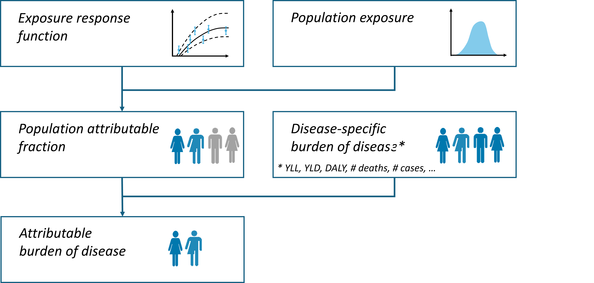
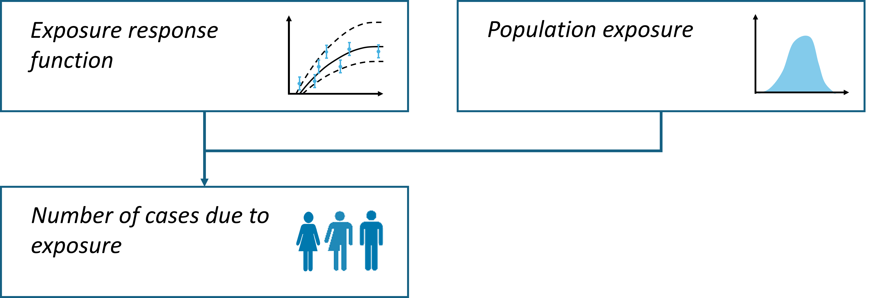

------------------------------------------------------------------------

```{r, include = FALSE}
knitr::opts_chunk$set(
  collapse = TRUE,
  comment = "#>"
)
options(rmarkdown.html_vignette.check_title = FALSE)

library(healthiar)
library(tibble)
library(dplyr)
library(purrr)
library(tidyr)
library(stringr)
library(knitr)
# library(pillar) # Used in some code that's currently commented out

## Avoid using pacman here, as it causes error in installation if it's not installed already
# library(pacman)
# pacman::p_load(healthiar, tibble, dplyr, purrr, tidyr, stringr, pillar, knitr)

options(knitr.kable.max_rows = 10)
set.seed(1)
```

Hi there!

This vignette will 1) tell you about `healthiar`, 2) help you install the `healthiar` package, and 3) show you how to use `healthiar` with the help of examples.

*NOTE*: By using healthiar you agree to the [terms of use](https://github.com/best-cost/best-cost_WPs?tab=readme-ov-file#readme) and confirm you have read the [disclaimer](https://github.com/best-cost/best-cost_WPs?tab=readme-ov-file#readme).

*NOTE*: the development of `healthiar` is still ongoing. Any feedback regarding bugs, unclear documentation, ... is welcome and highly appreciated. Please provide feedback via a [GitHub issue](https://github.com/best-cost/best-cost_WPs/issues).

------------------------------------------------------------------------

# About `healthiar`

The `healthiar` functions allow you to quantify and monetize the health impacts of environmental stressors (air pollution & noise)

`healthiar` core *family members* (= functions)

-   `attribute_health()` to env. exposure with either relative or absolute risk
-   `attribute_lifetable()` life table analysis (RR & AR)
-   `summarize_uncertainty()` Monte Carlo simulation
-   `attribute_mod()` modify an existing assessment
-   `compare()` two scenarios
-   `monetize()` health impacts
-   `cba()` cost-benefit analysis
-   `socialize()` to discover inequalities in health impacts
-   `get_mdi()` creates the BEST-COST MDI (Multidimensional Deprivation Index)
-   `get_daly()` by adding up YLL & YLD
-   `get_multiexposure` approaches to consider exposure to 2 air pollutants

## Updating `healthiar`

After the initial installation we recommend to regularly update the `healthiar` R package by running the following code

```{r eval=FALSE}
remotes::install_github(
  repo = "best-cost/best-cost_WPs",
  subdir = "/r_package/healthiar",
  force = TRUE,
  build_vignettes = TRUE
)
```


## Refresher - Burden of disease with relative risk

{width="700"}

## Refresher - Burden of disease with absolute risk

{width="700"}

## Package overview
{width="700"}


# `healthiar` Examples

## Example data sets
`healthiar` comes with some example data that start with `exdat_` that allow you to test functions.

```{r, eval=TRUE, echo=FALSE, include=TRUE}
package_data <- data(package = "healthiar")[["results"]] |> 
  as_tibble() |> 
  select(Item) |> 
  filter(str_detect(Item, "exdat")) |> 
  mutate(Item = stringr::str_replace(Item, " \\(example_data\\)", "")) |> 
  rename(example_variables = Item) |> 
  # print()
  pull(example_variables) |>
  print()
  # cat(paste(collapse = "\n"), "\n")
```

## Example: `attribute_health()` with relative risk

Goal: attribute COPD cases to air pollution

### Function call - Hard coded

```{r}
results_pm_copd <- attribute_health(
  erf_shape = "log_linear", # Alternatives: "linear", "log_log"
  rr_central = 1.369, 
  rr_increment = 10,  # μg / m^3
  exp_central = 8.85, # μg / m^3
  cutoff_central = 5, # μg / m^3
  bhd_central = 30747 # baseline health data: COPD incidence
) 
```


### Function call - Pre-loaded data

We call the `attribute_health` with input data from the package example data. Note that we provide input data to the function argument using the `$` operator.

```{r, eval=TRUE, include=TRUE, echo=TRUE}
results_pm_copd <- attribute_health(
  erf_shape = "log_linear",
  rr_central = exdat_pm_copd$relative_risk, 
  rr_increment = 10, 
  exp_central = exdat_pm_copd$mean_concentration,
  cutoff_central = exdat_pm_copd$cut_off_value,
  bhd_central = exdat_pm_copd$incidence
)
```
### Output structure

Every attribute output consists of two lists ("folders")

-   `health_main` contains the main results

-   `health_detailed` detailed results (saved in the tibble `raw)` and (in some cases) even more information about the assessment/calculation

### Main results

Let's inspect the main results

There exist different, equivalent ways of accessing the output

-    By mouse: go to the *Environment* tab in RStudio and click on the variable you want to inspect, and then open the `health_main results` table

-    With `$` operator: `results_pm_copd$health_main$impact_rounded`

-    With `[[]]` operator `results_pm_copd[["health_main"]]`

-    With `pluck()` & `pull()`: use the `purrr::pluck` function to select a list and then the `dplyr::pull` function extract values from a specified column, e.g. `results_pm_copd |> purrr::pluck("health_main") |> dplyr::pull("impact_rounded")`

```{r, include=TRUE, eval=TRUE, echo=TRUE}
results_pm_copd$health_main
```

It is a tibble of 3 rows and 22 columns. Let's zoom in on some relevant aspects

```{r}
results_pm_copd$health_main |> 
  select(exp, bhd, rr, erf_ci, pop_fraction, impact_rounded) |> 
  knitr::kable() # Prints tibble in a minimal layout
```

Interpretation: this table shows us that exposure was 8.85 $\mu g/m^3$, the baseline health data (bhd) was 30747 (COPD cases in this instance). The 1st row further shows that the impact attributable to this exposure using the central relative risk (rr) estimate of 1.369 is 3502 COPD cases, or \~11% of all baseline cases.

Some of the most relevant columns include:

-   *impact_rounded* Rounded attributable health impact/burden
-   *impact* Raw impact/burden
-   *pop_fraction* Population attributable fraction (PAF)
-   *erf_ci* Specifies whether `rr_central`, `..._lower` or `..._upper` was used to obtain impact
-   *rr* Raw RR used in calculation
-   *exp* Exposure
-   *bhd* Baseline health data

*NOTE*: the main output contains more columns that provide additional information about the assessment, such as cutoff, the relative risk at the observed exposure level, the shape of the ERF, ...


## Example: `attribute_health()` with relative risk & uncertainty

Goal: attribute COPD cases to PM2.5 exposure

Now we will make a similar function call, but include uncertainty in several input arguments.

### Function call

```{r}
results_pm_copd <- attribute_health(
    erf_shape = "log_linear",
    rr_central = 1.369, 
    rr_lower = 1.124, 
    rr_upper = 1.664,
    rr_increment = 10, 
    exp_central = 8.85, 
    exp_lower = 8, 
    exp_upper = 10,
    cutoff_central = 5,
    bhd_central = 30747, 
    bhd_lower = 28000, 
    bhd_upper = 32000
) 
```
### Detailed results

Let's inspect the detailed results:

```{r}
results_pm_copd |> 
  purrr::pluck("health_detailed") |>
  purrr::pluck("impact_raw") |> 
  dplyr::select(contains("_ci"), impact_rounded) |> 
  knitr::kable() # Prints tibble in a minimal layout
```
Each row shows a result from a specific calculation pathway that used all the input data & calculation pathway specifications shown in that row

-   The 1st row shows the impact when using the central estimates of each input variable

-   The 2nd row shows the impact when using the central estimates of the relative risk, exposure in combination with the lower estimate of the baseline health

-   ...

(*NOTE*: that only 9 of the 27 possible combinations are displayed due to space constraints.)


## Example: `attribute_health()` with absolute risk

Goal: attribute cases of high annoyance to (road) noise exposure

### Function call

```{r}
results_noise_ha <- attribute_health(
  approach_risk = "absolute_risk",
  exp_central = c(57.5, 62.5, 67.5, 72.5, 77.5),
  pop_exp = c(387500, 286000, 191800, 72200, 7700),
  erf_eq_central = "78.9270-3.1162*c+0.0342*c^2"
)

```

### Main results
```{r echo=FALSE}
results_noise_ha |> 
  pluck("health_main") |>
  select(erf_eq, erf_ci, impact_rounded) |> 
  knitr::kable() # Prints tibble in a minimal layout
```

### Results per noise exposure band

```{r, echo=TRUE, eval=FALSE, include=TRUE}
results_noise_ha$health_detailed$impact_raw
```
```{r, echo=FALSE, eval=TRUE, include=TRUE}
results_noise_ha[["health_detailed"]][["impact_raw"]] |> 
  select(exposure_dimension, exp, pop_exp, impact) |> 
  knitr::kable()
```


## Example: `attribute_health()` for multiple geographic units (iteration)

Goal: attribute disease cases to PM2.5 exposure in multiple geographic units, such as municipalities, provinces, countries, ...

-   For iterations, enter geo unit-specific inputs as a list

-   Feed unique geo ID's as a vector to the `geo_id_disaggregated` argument (e.g. municipality names)

-   Optional: aggregate geo unit-specific results by providing higher-level ID's (e.g. region names) to the `geo_id_aggregated` argument (as a vector)

### Function call with `list()`

Use `list()` in case you enter each single input value specifically as a list element.
```{r}
results_iteration <- attribute_health(
    geo_id_disaggregated = c("Zurich", "Basel", "Geneva", "Ticino", "Valais"), 
    geo_id_aggregated = c("Ger","Ger","Fra","Ita","Fra"),
    rr_central = 1.369,
    rr_increment = 10, 
    cutoff_central = 5,
    erf_shape = "log_linear",
    exp_central = list(11, 11, 10, 8, 7),
    bhd_central = list(4000, 2500, 3000, 1500, 500)
)
```

### Function call with `as.list()`

Use `as.list()` in case the inputs are vectors.
```{r}
results_iteration <- attribute_health(
    geo_id_disaggregated = c("Zurich", "Basel", "Geneva", "Ticino", "Valais"), 
    geo_id_aggregated = c("Ger","Ger","Fra","Ita","Fra"),
    rr_central = 1.369,
    rr_increment = 10, 
    cutoff_central = 5,
    erf_shape = "log_linear",
    exp_central = as.list(c(11, 11, 10, 8, 7)),
    bhd_central = as.list(c(4000, 2500, 3000, 1500, 500))
)
```

In this example we want to aggregate results by language region (`"Ger", "Fra", "Ita"`)


### Main results

The main output contains aggregated results if available, or disaggregated results if no aggregation ID was provided

```{r echo=TRUE,eval=FALSE,include=TRUE}
results_iteration$health_main
```
```{r, echo=FALSE,include=TRUE,eval=TRUE}
results_iteration[["health_main"]] |> 
  dplyr::select(geo_id_aggregated, impact_rounded, erf_ci, exp_ci, bhd_ci) |> 
  knitr::kable()
```
Main (= *aggregated*). The cumulative / summed number of stroke cases attributable to PM2.5 exposure in the 5 geo units is 14560 (using a relative risk of 1.369).

### Detailed results
The geo unit specific information and results are stored in `health_detailed`. Filter for the main result for each geo unit as follows

```{r, echo=TRUE,eval=FALSE,include=TRUE}
results_iteration$health_detailed$impact_raw
```
```{r, echo=FALSE,include=TRUE,eval=TRUE}
results_iteration[["health_detailed"]][["impact_raw"]] |> 
  select(geo_id_disaggregated, geo_id_aggregated, impact_rounded) |> 
  knitr::kable()
```

Besides the results per geo unit, `health_detailed` also contains impacts obtained through all combinations of input data central, lower and upper estimates.

## Example: `compare()`

Goal: comparison of two scenarios

### Function call

1.  Use `attribute_health()` to calculate burden of scenarios A & B

```{r}
scenario_A <- attribute_health(
    exp_central = 8.85,   # EXPOSURE 1
    cutoff_central = 5, 
    bhd_central = 25000,
    approach_risk = "relative_risk",
    erf_shape = "log_linear",
    rr_central = 1.118,
    rr_increment = 10)
```
```{r}
scenario_B <- attribute_health(
    exp_central = 6,     # EXPOSURE 2
    cutoff_central = 5, 
    bhd_central = 25000,
    approach_risk = "relative_risk",
    erf_shape = "log_linear",
    rr_central = 1.118,
    rr_increment = 10)
```

Alternatively, the function `attribute_mod()` can be used to modify an existing scenario, e.g. `scenario_A`
```{r}
scenario_B <- attribute_mod(
  output_attribute_1 = scenario_A, 
  exp_central = 6
)
```

2.  Use `compare()` to compare scenarios A & B
```{r}

results_comparison <- compare(
  
  approach_comparison = "delta", # or "pif" (population impact fraction)
  
  output_attribute_1 = scenario_A,
  
  output_attribute_2 = scenario_B
)
```

### Main results

The `compare()` results are very similar to `attribute_health()` results:

-   `health_main` contains main comparison results

-   `health_detailed`

    -   `impact_raw` raw comparison results

    -   `scenario_1` contains results of scenario 1 (scenario A in our case)

    -   `scenario_2` contains results of scenario 2 (scenario B in our case)

```{r eval=FALSE}
results_comparison$health_main
```
```{r echo=FALSE}
results_comparison[["health_main"]] |> 
  dplyr::select(
    impact, impact_rounded,
    impact_1, impact_2,
    bhd,
    dplyr::starts_with("exp_"),
    -dplyr::starts_with("exp_ci"), # remove col "exp_ci"
    dplyr::starts_with("rr_con")) |> 
  dplyr::slice_head() |> 
  knitr::kable()
```

## Example: `summarize_uncertainty()`

You can do a Monte Carlo uncertainty analysis via the `summarize_uncertainty` function.

The outcome of the Monte Carlo analysis is added to the variable entered as the `results` argument, which is `results_pm_copd` in our case.

Two folders are added:

-   `uncertainty_main` contains the central estimate and the corresponding 95% confidence intervals obtained through the Monte Carlo assessment

-   `uncertainty_detailed` contains all `n_sim` simulations of the Monte Carlo assessment

### Function call

```{r}
results_pm_copd <- 
  summarize_uncertainty(
    results = results_pm_copd,
    n_sim = 1000
)
```

### Main results

```{r}
print(
  results_pm_copd |> 
  purrr::pluck("uncertainty_main")
  )
```

### Detailed results

```{r}
results_pm_copd |> 
  purrr::pluck("uncertainty_detailed") |> 
  purrr::pluck("raw") |> 
  select(rr:impact_total) |> 
  knitr::kable()
```

## Example: `monetize()`

You can monetize the obtained health impacts via the `include_monetization` function.

### Function call

```{r}
results_pm_copd <- 
  monetize(
    output_healthiar = results_pm_copd,
    discount_shape = "exponential",
    discount_rate = 0.03,
    discount_years = 5,
    valuation = 50000, # E.g. EURO
    discount_overtime = "all_years"
  )
```

### Main results

```{r}
results_pm_copd$monetization_main |> 
  select(erf_ci, monetized_impact) |> 
  knitr::kable()
```

We see that the monetized impact (discounted) is more than 160 million EURO.

The outcome of the monetization is added to the variable entered to the `output_healthiar` argument, which is `results_pm_copd` in our case.

Two folders are added:

-   `monetization_main` contains the central monetization estimate and the corresponding 95% confidence intervals obtained through the specified monetization

-   `monetization_detailed` contains the monetized results for each unique combination of the input variable estimates that were provided to the initial `attribute_health()` call

## Example: `cba()`

Adding a cost-benefit analysis (CBA) using the results

Let's imagine we design a policy that would reduce air pollution to 5 $\mu g/m^3$, which is the concentration specified in the `cutoff_central` argument in the initial `attribute_health()` call. So we could avoid all COPD cases attributed to air pollution.

What would be the monetary benefit of such a policy, considering also the cost to implement the policy (estimated at 100 million EURO)? We can find out using `healthiar`'s `cba()` function.

### Function call
```{r}
cba <- 
  cba(
    output_healthiar = results_pm_copd,
    valuation = 50000,
    cost = 100000000,
    discount_shape = "exponential",
    discount_rate_benefit = 0.03,
    discount_rate_cost = 0.03,
    discount_years_benefit = 5,
    discount_years_cost = 5,
    discount_overtime = "all_years"
  )
```

### Main results

```{r}
cba$cba_main |>  
  select(benefit, cost, net_benefit) |> 
  knitr::kable()
```

We see that the central and upper 95& confidence interval estimates of avoided attributable COPD cases result in a net monetary benefit of the policy, while the lower 95% confidence interval estimate results in a net cost!

The outcome of the CBA is contained in two folders are added:

-   `cba_main` contains the central estimate and the corresponding 95% confidence intervals obtained

-   `cba_detailed` contains additional intermediate results for both cost and benefit

    - `benefit` contains results `by_year` and raw results `health_raw`
    
    - `cost`

## Example: `socialize()`

`socialize()` features

-   *Stand-alone use* the function can either be used with an `attribute_...` output or an *external* health impact

-   *Use of deprivation indicator* BEST-COST Multidimensional Deprivation Index (MDI) or any other (single) deprivation indicator, e.g. household income

First create an `attribute_health()` using example data set `exdat_mdi`

```{r}
results_social <- attribute_health(
    geo_id_disaggregated = exdat_mdi$CS01012020,
    rr_central = 1.08,
    erf_shape = "log_linear", 
    rr_increment = 10,
    exp_central = as.list(exdat_mdi$PM25_MEAN),
    cutoff_central = 0,
    bhd_central = as.list(exdat_mdi$MORTALITY_TOTAL),
    population = exdat_mdi$POPULATION
)
```
### Function call

Then run `socialize()`

```{r}
results_social <- socialize(
  output_healthiar = results_social,
  geo_id_disaggregated = exdat_mdi$CS01012020,
  social_indicator = exdat_mdi$score,
  n_quantile = 10
)
```

### Main results

`socialize()` adds two main lists ("folders") to the inputted health impacts

-   `social_main` contains total results

-   `social_detailed`

    -   `results_detailed`

    -   `overview_quantiles`

```{r eval=FALSE}
results_social[["social_main"]]
```
```{r, echo=FALSE}
results_social[["social_main"]] |> 
  slice(3,4) |> 
  select(difference_value, difference_type, comment, overall, last) |> 
  knitr::kable()
```

## Example: `attribute_lifetable()` for YLL

### Function call
```{r}
results_pm_yll <- attribute_lifetable(
  health_outcome = "yll",
  approach_exposure = "single_year",
  exp_central = 8.85,
  prop_pop_exp = 1,
  cutoff_central = 5,
  rr_central =  1.118, 
  rr_increment = 10,
  erf_shape = "log_linear",
  first_age_pop = 0,
  last_age_pop = 99,
  deaths_male = exdat_pop_1$number_of_deaths_male,
  deaths_female = exdat_pop_1$number_of_deaths_female,
  population_midyear_male = exdat_pop_male$population_2019, 
  population_midyear_female = exdat_pop_female$population_2019,
  year_of_analysis = 2019, 
  min_age = 20,
  info = "pm2.5_yll"
) 
```

### Main results
TODO

## Example: `attribute_health()` for YLD

### Function call
```{r}
results_pm_copd_yld  <- attribute_health(
    exp_central = 8.85,
    prop_pop_exp = 1,
    cutoff_central = 5,
    bhd_central = 1000,
    rr_central = 1.1, 
    rr_increment = 10, 
    erf_shape = "log_linear",
    info = "pm2.5_yld",
    duration_central = 100,
    dw_central = 1
)
```

### Main results
TODO

## Example: `get_daly()`

### Function call
```{r}
results_daly <- get_daly(
     output_attribute_yll = results_pm_yll,
     output_attribute_yld = results_pm_copd_yld)
```

### Main results
TODO

## Example: `get_multiexposure()`

### Function call

```{r}
results_pm_copd <- attribute_health(
  erf_shape = "log_linear",
  rr_central = 1.369, 
  rr_increment = 10,
  exp_central = 8.85,
  cutoff_central = 5,
  bhd_central = 30747
) 

results_no2_copd <- attribute_mod(
  output_attribute_1 = results_pm_copd,
  exp_central = 10.9,
  rr_central = 1.031
)

results_multiplicative <- get_multiexposure(
  output_attribute_1 = results_pm_copd,
  output_attribute_2 = results_no2_copd,
  exposure_name_1 = "pm2.5",
  exposure_name_2 = "no2",
  approach = "multiplicative"
)
```

### Main results
TODO

## Example: `get_mdi`

Note: the `ggplot2` must be installed in order to use this function!

### Function call

```{r echo=TRUE, eval=FALSE, include=TRUE}
mdi <- get_mdi(
  geo_id_disaggregated = exdat_get_mdi$id,
  edu = exdat_get_mdi$edu,
  unemployed = exdat_get_mdi$unemployed,
  single_parent = exdat_get_mdi$single_parent,
  pop_change = exdat_get_mdi$pop_change,
  no_heating = exdat_get_mdi$no_heating,
  n_quantile = 10
)
```

### Main results
TODO

# Post-`healthiar` workflow

## Export results

Export as `.csv` file

```{r, eval=FALSE}
write.csv(x = results_pm_copd$health_main, file = "exported_results/results_pm_copd.csv")
```

Save as `.Rdata` file

```{r, eval=FALSE}
save(results_pm_copd, file = "exported_results/results_pm_copd.Rdata")
```

Export to Excel (as `.xlsx` file)

```{r, eval=FALSE}
openxlsx::write.xlsx(x = results_pm_copd$health_main, file = "exported_results/results_pm_copd.xlsx")
```

## Visualize results

Visualization is out of scope of `healthiar`. You can visualize in

-   R, e.g. with the `ggplot2` package ([online book by the creator](https://ggplot2-book.org/))
-   Excel (export results first)
-   Other tools

